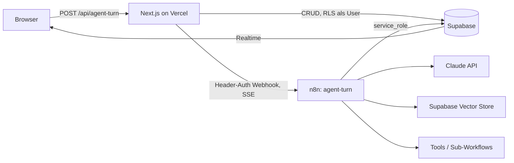
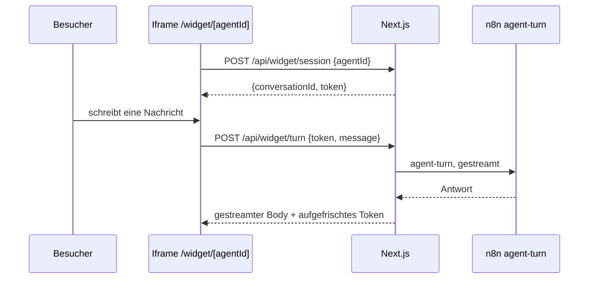
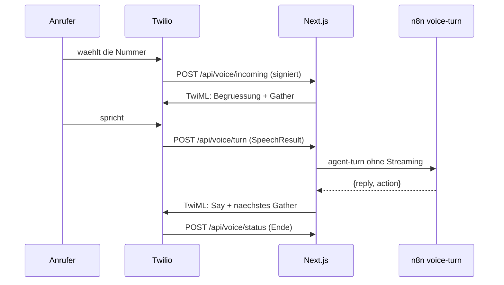

# Norra

AI-gestützte Customer-Support-Plattform. Dieses Verzeichnis ist die Wurzel des
Norra-Projekts und **unabhängig vom umgebenden n8n-Monorepo**.

> Das umgebende Repository ist ein Fork des n8n-Monorepos. `norra/` ist bewusst
> **nicht** in der Wurzel-`pnpm-workspace.yaml` eingetragen: n8n's Turbo-Build
> und CI fassen diesen Code nie an, und der Fork bleibt upstream-mergefähig.
> Deshalb hat `norra/app` eine eigene `package.json` und ein eigenes Lockfile.

## Leitprinzip

Alles, was Logik enthält, lebt entweder als Code in Git oder als Workflow-JSON
in Git. Es gibt keinen Zustand, der nur durch Klicken in einer UI entstanden ist.

## Architektur



**Next.js ist dünn.** Es macht Auth, UI/Dashboard, direkte Supabase-Reads und
genau einen Proxy (`/api/agent-turn`), der die User-Message persistiert, den
n8n-Webhook aufruft und den gestreamten Body 1:1 durchreicht. Es enthält
**keine** Claude-Integration und **keine** Vektor-Suche.

**n8n ist die Intelligenz.** Zentraler Workflow `agent-turn`: Webhook
(`responseMode: streaming`, Header-Auth) → AI Agent Node (Streaming) →
Supabase Vector Store als Retrieval-Tool → Custom Tools und Sub-Agenten via
Execute-Workflow-Node.

**Supabase ist die einzige Integrationsfläche.** n8n schreibt Ergebnisse per
Supabase-Node zurück; Realtime pusht sie an Chat-UI und Handoff-Dashboard.
Next.js und n8n sprechen nie direkt miteinander außer über den einen Webhook.

## Ordnerstruktur

| Pfad | Inhalt |
|---|---|
| `norra/app/` | Next.js App Router (Vercel Root Directory) |
| `norra/supabase/migrations/` | SQL-Migrationen, per GitHub Action ausgerollt |
| `norra/n8n-workflows/` | Exportierte Workflow-JSONs (Sync via REST-API) |
| `norra/scripts/` | Sync-/Wartungsskripte |
| `norra/tests/voice/` | Anrufpfad end-to-end gegen die gebaute App |
| `norra/tests/widget/` | Widget-Pfad end-to-end gegen die gebaute App |
| `norra/tests/mocks/` | Von beiden geteilte Stand-ins für PostgREST und n8n |
| `norra/docs/` | Architektur- und Betriebsnotizen |

## Namenskonventionen

- **Datenbank:** `snake_case`, Tabellen im Plural, Enums als Postgres-Typen im
  Singular (`user_role`, `conversation_status`). Jede fachliche Tabelle trägt
  `organization_id` — auch wo es redundant wirkt.
- **Migrationen:** `<utc-timestamp>_<beschreibung>.sql`, aufsteigend, niemals
  rückwirkend editieren. Eine Migration = eine logische Einheit.
- **TypeScript:** `camelCase` für Variablen, `PascalCase` für Typen. Kein `any`.
  DB-Zeilen kommen aus `Database` in `src/types/database.ts`.
- **n8n-Workflows:** Dateiname = `<slug>.json`, Slug = Workflow-Name in
  kebab-case (`agent-turn.json`).

## Multi-Tenant-Regeln

Diese vier Regeln sind nicht verhandelbar:

1. **Jede fachliche Tabelle hat `organization_id`** mit
   `references organizations(id) on delete cascade`. Denormalisiert statt
   Join — RLS ohne Subquery ist schneller und schwerer falsch zu schreiben.
2. **RLS ist auf jeder Tabelle aktiv.** Policies vergleichen gegen
   `private.current_org_id()`, eine `security definer`-Funktion mit gepinntem
   `search_path`, die `public.users` für `auth.uid()` liest. `security definer`
   umgeht RLS und vermeidet damit die Endlosrekursion in der Policy auf `users`.
3. **n8n verbindet sich mit `service_role` und umgeht RLS damit vollständig.**
   Im n8n-Pfad ist RLS *keine* Verteidigungslinie. Mandantentrennung dort hängt
   allein daran, dass `public.match_kb_chunks` die `organization_id`
   serverseitig erzwingt und ohne sie hart fehlschlägt. Jede neue RPC, die n8n
   aufruft, muss dieselbe Erzwingung mitbringen.
4. **Ein User gehört zu genau einer Organisation** (`users.organization_id`).
   Multi-Org wäre später eine `organization_members`-Tabelle; bis dahin gilt
   die Spalte.

## Rollen

`user_role` = `admin` | `agent` | `customer`.

- `admin` — verwaltet Agenten, Wissensbasis und Mitglieder der eigenen Org.
- `agent` — menschlicher Support-Mitarbeiter, übernimmt Konversationen.
- `customer` — **reserviert** für ein späteres authentifiziertes Kundenportal.
  Endkunden im Chat-Widget sind heute *keine* Supabase-Auth-User; der
  Widget-Pfad läuft über den Next.js-Proxy mit signiertem Conversation-Token.

## Environment

| Variable | Wo | Zweck |
|---|---|---|
| `NEXT_PUBLIC_SUPABASE_URL` | Vercel, lokal | Supabase-Projekt-URL |
| `NEXT_PUBLIC_SUPABASE_ANON_KEY` | Vercel, lokal | Client-/SSR-Key, RLS greift |
| `SUPABASE_SERVICE_ROLE_KEY` | nur Server | umgeht RLS — niemals an den Client |
| `N8N_WEBHOOK_URL` | Vercel | Basis-URL der n8n-Instanz |
| `N8N_WEBHOOK_SECRET` | Vercel + n8n | Header-Auth zwischen Proxy und Webhook |
| `TWILIO_AUTH_TOKEN` | nur Server, optional | Signaturprüfung der Telefonie-Webhooks |
| `NORRA_PUBLIC_URL` | Vercel, optional | öffentliche Basis-URL für Telefonie-Signatur und Embed-Code |

Das Web-Widget braucht keine eigene Variable — sein Signaturschlüssel leitet
sich aus `N8N_WEBHOOK_SECRET` ab (siehe *Das Web-Widget* unten).

Secrets stehen niemals im Repo. `.env.local` ist gitignored;
`norra/app/.env.example` dokumentiert nur die Namen.

## n8n-Instanz

Hostinger VPS, self-hosted Community Edition: `https://n8n-fdhh.srv1817599.hstgr.cloud`

| Workflow | Slug | ID | Webhook-Pfad | Zweck |
|---|---|---|---|---|
| Agent Turn | `agent-turn` | `yTH3YQeR5qdNVxSI` | `POST /webhook/norra/agent-turn` | Zentraler Turn: Config laden, RAG, Streaming |
| Voice Turn | `voice-turn` | `wc4s77ROyul5LR5X` | `POST /webhook/norra/voice-turn` | Ein gesprochener Turn, ohne Streaming |
| KB Ingest | `kb-ingest` | `Q3XhlP6eet9eqnm0` | `POST /webhook/norra/kb-ingest` | Dokument chunken, einbetten, speichern |
| Tool: lookup_record | `tool-lookup-record` | `KHHKDV5CoyiDxuCO` | Sub-Workflow | Datensatz beim Kunden nachschlagen, read-only |
| Tool: escalate_to_human | `tool-escalate-to-human` | `pw6OzhBSG2oxagNt` | Sub-Workflow | Ticket anlegen, Konversation eskalieren |
| Tool: request_action | `tool-request-action` | `LwyJZr8WFsjd0L9v` | Sub-Workflow | Folgenreiche Aktion zur **Freigabe** einreichen |
| Notify Escalation | `notify-escalation` | `zU1x0scrqFmPClmg` | Sub-Workflow | E-Mail an das Support-Team |

### Ordnung auf der Instanz

Die Instanz hostet auch fremde Workflows. Die von Norra tragen deshalb Tags:

| Tag | Workflows |
|---|---|
| `norra` | alle sieben |
| `norra:core` | `agent-turn`, `voice-turn`, `kb-ingest` |
| `norra:tool` | `lookup_record`, `escalate_to_human`, `request_action` |
| `norra:notify` | `notify-escalation` |

Der Export filtert weiterhin über den Namenspräfix `Norra – `, nicht über Tags —
ein vergessener Tag würde einen Workflow sonst still aus dem Backup fallen lassen.

### Verdrahtung prüfen

```bash
cd norra && node scripts/check-wiring.mjs
```

Prüft drei Dinge, die still auseinanderlaufen und erst beim Kunden auffallen:
ein umbenannter Webhook-Pfad, ein Payload-Feld, das der Workflow nicht mehr
liest, und eine Spalte, in die ein Workflow schreibt, die es nicht mehr gibt.
Läuft in `norra-n8n-deploy.yml`, ausgelöst auch von Änderungen an Migrationen
und API-Routen — nicht nur an den Workflow-JSONs.

### Wer füllt die Auswertung

`topic`, `knowledge_gap` und `title` schreibt ein Klassifikations-Schritt am Ende
von `agent-turn`, nach der gestreamten Antwort — er kostet den Kunden also keine
Wartezeit. Ohne ihn bleiben Topic Explorer und Gap Detection dauerhaft leer.
`csat` kommt aus `/api/feedback`, das die Bewertungsleiste im Web-Widget nach
der ersten Antwort einblendet — einmalig pro Konversation, weggeklickt oder
beantwortet bleibt sie verschwunden. Die Route läuft über den Service-Role-Key
und authentifiziert wie jede andere Widget-Route über das signierte Token aus
`lib/widget/token.ts`, nicht über Konversations- und Organisations-ID im
Body: der Kanal *Web* ist der einzige, an dem eine Bewertung überhaupt anfällt,
also nutzt die Route dieselbe Vertrauensgrenze, die für diesen Kanal ohnehin
schon gilt, statt eine eigene zu erfinden.

Der Klassifikator nutzt `claude-opus-5` mit `temperature: 0`. Ein günstigeres
Modell wäre hier der naheliegende Kostenhebel — das ist eine bewusste
Entscheidung, keine Vorgabe.

### Freigaben statt Ausführung

`request_action` legt zusätzlich zum Ticket eine Zeile in `approvals` an. Das ist
die eigentliche Sperre: ein Ticket ist eine Notiz, die jemand übersehen kann,
eine Freigabe bleibt offen, bis ein Admin im Governance-Screen entscheidet. Ein
Check-Constraint verweigert jede Entscheidung ohne Entscheider.

Jedes weitere Tool mit realer Konsequenz gehört denselben Weg: Zeile in
`approvals`, Rückgabewert sagt dem Agenten ausdrücklich, dass nichts ausgeführt
wurde.

Alle sieben Workflows sind **angelegt, aber nicht aktiviert**. Vor der
Aktivierung fehlen zwei Credentials, die es auf der Instanz noch nicht gibt:

| Credential | Typ | Gebraucht von |
|---|---|---|
| Anthropic | `anthropicApi` | Claude Model in `agent-turn` und `voice-turn` |
| Norra Webhook Secret | `httpHeaderAuth` | alle drei Webhook-Nodes |

Die Header-Auth-Credential muss Header-Name `x-norra-secret` und als Wert
denselben String tragen wie `N8N_WEBHOOK_SECRET` in Vercel — sonst weist der
Webhook den Proxy ab. Supabase- und OpenAI-Credentials hat n8n beim Anlegen
automatisch zugeordnet.

### Tool-Regeln

Zwei Regeln, die für jedes neue Tool gelten:

1. **Der Mandant ist nie ein Modellfeld.** `organization_id` und
   `conversation_id` werden in den Tool-Nodes fest aus `Normalize Request`
   verdrahtet, nicht über die vom Modell befüllten Felder. Ein Modell, das den
   Mandanten wählen darf, ist ein Modell, das ihn verwechseln kann.
2. **`Return To Agent` steht zuletzt.** Ein Sub-Workflow gibt die Ausgabe seines
   letzten Nodes an den Aufrufer zurück. Steht das Logging hinten, bekommt der
   Agent Protokolldaten statt einer Antwort.

### Eskalations-Benachrichtigung

`escalate_to_human` ruft nach dem Ticket `notify-escalation` auf. Der Empfänger
steht in der Spalte `organizations.escalation_email` — pro Organisation im
Screen *Einstellungen* konfigurierbar, ohne den Workflow anzufassen. Ist keine
Adresse hinterlegt, endet der Lauf sauber über `Return Skipped`.

Der Aufruf trägt `onError: continueRegularOutput`: eine fehlgeschlagene Mail
darf die Eskalation nicht scheitern lassen. Das Ticket ist der Vorgang, die Mail
nur der Hinweis darauf.

### Warum `request_action` nichts ausführt

Das Tool nimmt jede folgenreiche Aktion entgegen — Erstattung, Stornierung,
Datenänderung — und führt keine davon aus: es legt ein Ticket mit hoher
Priorität plus eine Zeile in `approvals` an, und sein Rückgabewert sagt dem
Agenten ausdrücklich, dass nichts ausgeführt wurde. Grund: ein Sprachmodell, das
eine Vorgangsnummer oder einen Betrag halluziniert, würde sonst realen Schaden
anrichten, der nicht zurückzuholen ist.

Wenn eine Aktion später autonom laufen soll, gehört sie als eigener Zweig hinter
die Freigabe — mit Obergrenze, Whitelist und Idempotenzschlüssel gegen
Doppelausführung, nicht als weiteres Modellfeld.

### Tool-Endpunkte gehören dem Kunden

`lookup_record` ruft keinen fest verdrahteten Dienst auf. Die URL steht pro
Agent in `agents.tools` als `[{"slug": "lookup_record", "enabled": true,
"config": {"url": "https://..."}}]` und wird im Agenten-Editor gepflegt; der
Workflow liest sie zur Laufzeit aus `Load Agent Config`. Die Authentifizierung
läuft über die n8n-Credential `httpHeaderAuth` — der Endpunkt selbst steht
damit in der Datenbank, das Geheimnis nicht. Das Formular verlangt `https://`,
weil der Aufruf Kundenkennungen trägt.

### Warum die History aus dem Proxy kommt

Der Proxy liest die letzten 20 Nachrichten aus `messages` und schickt sie im
Request-Body mit, statt dass n8n sie selbst abfragt. Grund: bei der ersten
Nachricht einer Konversation liefert die Abfrage null Zeilen, und n8n
überspringt Nodes ohne Input-Items — die Kette wäre gestorben, bevor der Agent
je gelaufen wäre. Nebeneffekt: `messages` bleibt einzige Quelle der Wahrheit,
es gibt keine zweite History-Tabelle (deshalb auch kein Postgres-Chat-Memory).

### Ohne Entwicklung nutzbar

Ein Agent lässt sich vollständig ohne Codezugriff aufbauen und live schalten:
eine Vorlage liefert System-Prompt und Guardrails, der Editor deckt Tools,
Kanäle und Testfälle ab, und der Kanal *Web* endet in einem Code, den man in
die eigene Website einfügt — nirgends dazwischen ist ein Deploy oder ein Ticket
nötig.

**Vorlagen** (`agents/templates.ts`) sind statische Startpunkte, keine
KI-Generierung: Next.js hat bewusst keine Claude-Integration, siehe
Architektur oben. Eine Vorlage füllt System-Prompt, verbotene Themen und
Standard-Tools vor; `[Unternehmen]` im Text ist ein Platzhalter, den der
Betreiber vor dem Livegang ersetzt — Norra kennt den Firmennamen zum
Anlagezeitpunkt nicht.

**Kanäle** (`agents.channels`) entscheiden, wo ein Agent überhaupt erreichbar
ist; die Datenbank verweigert eine leere Liste. Voice hängt zusätzlich an einer
Nummer in `phone_numbers`, Web direkt am Widget unten.

**Testfälle** (`agent_test_cases`) sind jetzt ein Formular auf der
Agenten-Seite, nicht mehr nur ein Datenbank-Insert — das war die letzte Lücke,
die für "vor dem Start testen" einen Entwickler gebraucht hätte.

### Das Web-Widget

Der einzige Kanal, auf dem eine Organisation einen Agenten heute selbst vor
echte Kunden stellt, ohne Telefonnummer oder E-Mail-Anbindung. Der Code, den
der Kunde in seine Seite einfügt, steht direkt auf der Agenten-Seite, sobald
der Kanal *Web* aktiv ist:

```html
<script src="https://<host>/api/widget/embed" data-agent="<agent-id>" async></script>
```

Das Skript liest seinen eigenen `data-agent` und die eigene `src`-Origin aus
und hängt einen schwebenden Button plus ein Iframe auf `/widget/[agentId]` ein
— dieselbe Zeile funktioniert auf jeder Domain und jedem Deploy, ohne dass der
Betreiber eine Basis-URL eintragen muss.



Drei Entscheidungen, die nicht offensichtlich sind:

1. **Das signierte Token ist die gesamte Vertrauensgrenze**, nicht bloß eine
   Ergänzung zu ihr. Ein Website-Besucher ist kein Supabase-User; `/api/widget/*`
   liegt in `PUBLIC_PATHS` und jede Route liest `organization_id`, `agent_id`
   und `conversation_id` ausschließlich aus dem Token (`lib/widget/token.ts`),
   nie aus dem Request-Body. Ein Body-Feld mit einer fremden Organisations-ID
   wird schlicht ignoriert. Format ist HMAC-SHA256 über eine JSON-Payload, kein
   JWT — dieselbe Idee wie die Twilio-Signatur, mit demselben Beweisstandard:
   der Test versucht ein manipuliertes, ein für eine fremde Konversation
   gefälschtes und ein korrekt signiertes, aber abgelaufenes Token, und alle
   drei müssen an derselben Stelle scheitern.
2. **Es gibt kein zweites Secret.** Der Signaturschlüssel leitet sich aus
   `N8N_WEBHOOK_SECRET` ab (`hmac('sha256', 'widget:' + secret)`) statt eine
   eigene Umgebungsvariable zu verlangen, die ein Betreiber sonst separat
   rotieren müsste, ohne dass es irgendwo einen Grund dafür gäbe.
3. **Der Agent wird bei jedem Turn neu geprüft**, nicht nur beim Sessionstart.
   Schaltet ein Betreiber den Kanal *Web* mitten in einem Gespräch ab, bricht
   der nächste Turn sauber mit 404 ab, statt mit der alten Freigabe
   weiterzulaufen.

`/api/feedback` (CSAT) authentifiziert nach demselben Muster — ein Rating ohne
gültiges Token scheitert genauso wie ein Turn ohne eines.

**Bekannte Grenze:** Vercels Functions haben kein geteiltes Gedächtnis über
Aufrufe hinweg, klassisches Rate-Limiting nach IP oder Token geht dort also
nicht ohne einen externen Store. Der Ersatz ist eine harte Obergrenze an
Nachrichten pro Konversation (`MAX_MESSAGES_PER_CONVERSATION` in
`/api/widget/turn`), durchgesetzt gegen die einzige Größe, die tatsächlich
dauerhaft ist: die Zeilenzahl in `messages`. Schutz gegen einen verteilten
Angriff ist bewusst nicht Teil dieser Route — das ist die Ebene eines WAF oder
Cloudflare vor der Domain, nicht der Anwendung.

### Der Telefon-Assistent

Ein Anruf ist eine Konversation mit `channel = 'voice'`. Was ein Anruf mehr hat
als ein Chat — eine Nummer, eine Dauer, ein Ergebnis — steht in `calls`; die
Konfiguration der Leitung in `phone_numbers`.



**Einrichtung ist ein Formular, kein Ticket.** Der Kunde trägt beim Anbieter
zwei URLs ein — `/api/voice/incoming` und `/api/voice/status` — und weist im
Screen *Telefon* einen Agenten zu. Alles Weitere (Begrüßung, Stimme,
Öffnungszeiten, Weiterleitung, Zeitlimit) ist eine Zeile in `phone_numbers`.
Der Screen zeigt die fertigen URLs zum Kopieren; sie zu beschreiben statt sie
auszufüllen ist der Unterschied zwischen fünf Minuten und einem Support-Ticket.

Vier Entscheidungen, die nicht offensichtlich sind:

1. **Die gewählte Nummer *ist* der Mandant.** Ein eingehender Anruf trägt keine
   Organisations-ID, nur `To`. Deshalb ist der Index auf `phone_numbers.e164`
   global eindeutig, nicht pro Organisation — zwei Mandanten mit derselben
   Nummer wären keine Unannehmlichkeit, sondern ein Datenleck.
2. **Authentifiziert wird per Signatur, nicht per Session.** Ein Anrufer ist
   kein Supabase-User und ein Telefonanbieter schickt kein Cookie. Die Routen
   liegen deshalb in `PUBLIC_PATHS` der Middleware und prüfen stattdessen die
   Twilio-Signatur über die vollständige URL — weshalb `NORRA_PUBLIC_URL`
   Konfiguration ist und nicht aus `X-Forwarded-Host` erraten wird.
3. **`voice-turn` streamt nicht.** Im Chat wird jedes Token sofort sichtbar; am
   Telefon hört der Anrufer erst etwas, wenn ein Satz fertig ist. Dafür zählt
   die Gesamtdauer hart: der Anbieter bricht den Webhook nach wenigen Sekunden
   ab. Norra bricht bei 12 Sekunden selbst ab und leitet weiter, statt die
   Leitung verstummen zu lassen.
4. **`action` kommt aus der Datenbank, nicht aus dem Antworttext.** Ob
   weitergeleitet wird, entscheidet der Status der Konversation, den
   `escalate_to_human` setzt. Die Antwort nach „ich verbinde Sie" zu
   durchsuchen wäre raten — das Modell kann das sagen, ohne das Tool zu rufen.

Die bekannte Grenze: dieser Aufbau nutzt Sprache-zu-Text des Anbieters und
antwortet satzweise. Das ist spürbar langsamer als eine Media-Stream-Pipeline
mit Echtzeit-Transkription. Dafür braucht es keine zusätzliche Infrastruktur
und keine offene WebSocket-Verbindung — die Abwägung ist bewusst und der
richtige Ort für eine spätere Änderung ist `voice-turn`, nicht die App.

### Einstellungen

Die Regel, nach der entschieden wird, wo eine Einstellung lebt:

> Alles, was ein Workflow oder eine Policy liest, bekommt eine echte Spalte mit
> einem echten Constraint. `organizations.settings` (jsonb) trägt nur
> Darstellungsvorlieben.

Deshalb ist `escalation_email` aus dem jsonb-Blob in eine Spalte gewandert: ein
Blob nimmt `escalaton_email` widerspruchslos an, und die Mail hört still auf zu
kommen. Ebenso `timezone`, `locale` und `retention_days`.

Secrets stehen nie in der Datenbank. Der Screen *Einstellungen* zeigt zu jeder
Integration nur, **ob** sie konfiguriert ist — nie den Wert, auch nicht
maskiert: eine maskierte Zeichenkette verrät immer noch ihre Länge, und die
Seite sieht jedes Mitglied.

### Ladezustände und Bewegung

Jede Route hat eine `loading.tsx`, gebaut aus `src/components/skeleton.tsx`.
Die Platzhalter kopieren das echte Layout — gleiche Paddings, gleiche
Card-Rahmen, gleiche Spaltenzahl. Ein Skeleton mit anderer Form als das
Ergebnis erzeugt beim Eintreffen der Daten einen sichtbaren Sprung.

Der Verlaufsgraph in Analytics ist reines SVG, keine Chart-Bibliothek: eine
Polyline über eine feste `viewBox`, die sich per `stroke-dasharray` selbst
zeichnet.

`prefers-reduced-motion: reduce` entfernt **alle** Animationen, statt sie zu
verkürzen — ein Shimmer mit 0.01s flackert weiterhin. Wer dort eine Animation
ergänzt, prüft eine Sache: hängt die Sichtbarkeit an einer echten Eigenschaft,
die die Animation verändert (`stroke-dashoffset`, `opacity: 0` im
Ausgangszustand), muss sie im Reduced-Motion-Block zurückgesetzt werden. Sonst
sieht diese Nutzergruppe das Element nie.

## GitHub ↔ n8n Synchronisation

n8n's native Git-Environments sind Enterprise-only und auf der Community-Instanz
nicht verfügbar. Dieselbe Wirkung erreicht `norra/scripts/n8n-sync.mjs` über die
öffentliche REST-API:

| Action | Auslöser | Was passiert |
|---|---|---|
| `norra-n8n-backup.yml` | täglich 03:17 UTC, manuell | zieht die Workflows, committet Drift auf `master` |
| `norra-n8n-deploy.yml` | Push auf `master` unter `norra/n8n-workflows/**` | spielt die Dateien per `PUT` zurück |

```bash
cd norra
export N8N_BASE_URL=https://n8n-fdhh.srv1817599.hstgr.cloud
export N8N_API_KEY=...                       # n8n: Settings -> API
node scripts/n8n-sync.mjs export --dry-run   # was würde sich in git ändern
node scripts/n8n-sync.mjs deploy --dry-run   # was würde auf die Instanz gehen
```

Drei Eigenschaften, auf die man sich verlassen kann:

1. **Export fasst nur `Norra – …` an.** Auf der Instanz liegen fremde Workflows
   (Sales-Team, Jarvis-Template, …). Der Namenspräfix-Filter ist die Grenze;
   ohne ihn würde ein Backup sie ins Repo ziehen.
2. **Deploy legt nichts an und löscht nichts.** Geschrieben wird ausschließlich
   auf IDs, die eine Repo-Datei in ihrem `norra`-Block beansprucht. Alle IDs
   werden vorab aufgelöst — schlägt eine fehl, wird **gar nichts** geschrieben,
   statt einen halb deployten Stand zu hinterlassen.
3. **Credentials überleben einen Deploy.** Die Repo-Dateien enthalten keine
   Credential-Verweise. Deploy übernimmt sie deshalb pro Node aus der laufenden
   Fassung — sonst würde jeder Deploy die Verknüpfungen abreißen.

Volatile Felder (`updatedAt`, `versionId`, `id`, …) werden beim Export
entfernt, damit ein unveränderter Workflow keinen Diff erzeugt und ein echter
nicht darin untergeht.

**Eine Ausnahme vom Leitprinzip, bewusst:** die Workflow-`description` im
n8n-Editor. Die öffentliche API nimmt sie auf `PUT` nicht an (`400`), also
kann sie nicht zurückgespielt werden und wird deshalb auch nicht exportiert.
Die versionierte Erklärung eines Workflows sind die Sticky Notes auf dem
Canvas — die liegen als Nodes in der Repo-Datei. Die `description` ist nur
die Zeile in der Workflow-Liste; nichts Fachliches gehört dort hinein.

### Benötigte GitHub-Secrets

| Secret | Wofür |
|---|---|
| `N8N_BASE_URL` | `https://n8n-fdhh.srv1817599.hstgr.cloud` |
| `N8N_API_KEY` | n8n → Settings → API |
| `SUPABASE_ACCESS_TOKEN` | Migrationen ausrollen |
| `SUPABASE_PROJECT_ID` | Migrationen ausrollen |
| `SUPABASE_DB_PASSWORD` | Migrationen ausrollen |

## Befehle

```bash
cd norra/app && npm install     # Abhängigkeiten (eigenes Lockfile!)
npm run dev                     # Dev-Server
npm run typecheck               # tsc --noEmit, muss vor jedem Commit grün sein
npm run lint

cd norra && supabase db push    # Migrationen ausrollen (macht sonst die Action)
supabase gen types typescript --linked > app/src/types/database.ts
```

Den Anrufpfad gegen die gebaute App testen -- 16 Szenarien vom eingehenden
Anruf bis zum Status-Callback, mit echten Twilio-Signaturen:

```bash
cd norra && node tests/voice/run.mjs
```

Der Test baut die App selbst, weil `NEXT_PUBLIC_*` beim Bauen eingesetzt wird:
eine gegen die echte Supabase-URL gebaute App redet auch dann mit ihr, wenn die
Umgebungsvariable beim Start eine andere ist.

Migrationen und Mandantentrennung gegen ein blankes Postgres pruefen -- genau
das, was `norra-db-migrate.yml` in CI tut:

```bash
cd norra/supabase
psql -v ON_ERROR_STOP=1 -f tests/bootstrap.local.sql
for f in migrations/*.sql; do psql -v ON_ERROR_STOP=1 -q -f "$f"; done
for t in tenancy governance phone; do
  psql -v ON_ERROR_STOP=1 -f "tests/$t.test.sql"   # jeder muss "all checks passed" melden
done
```
