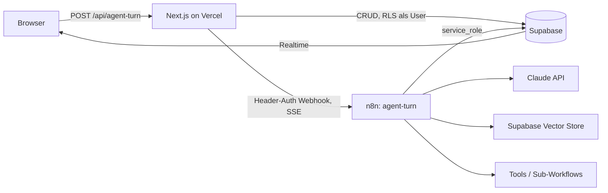

# Norra OS

AI-gestützte Customer-Support-Plattform. Dieses Verzeichnis ist die Wurzel des
Norra-OS-Projekts und **unabhängig vom umgebenden n8n-Monorepo**.

> Das umgebende Repository ist ein Fork des n8n-Monorepos. `norra/` ist bewusst
> **nicht** in der Wurzel-`pnpm-workspace.yaml` eingetragen: n8n's Turbo-Build
> und CI fassen diesen Code nie an, und der Fork bleibt upstream-mergefähig.
> Deshalb hat `norra/app` eine eigene `package.json` und ein eigenes Lockfile.

## Leitprinzip

Alles, was Logik enthält, lebt entweder als Code in Git oder als Workflow-JSON
in Git. Es gibt keinen Zustand, der nur durch Klicken in einer UI entstanden ist.

## Architektur



**Next.js ist dünn.** Es macht Auth, UI/Dashboard, direkte Supabase-Reads und
genau einen Proxy (`/api/agent-turn`), der die User-Message persistiert, den
n8n-Webhook aufruft und den gestreamten Body 1:1 durchreicht. Es enthält
**keine** Claude-Integration und **keine** Vektor-Suche.

**n8n ist die Intelligenz.** Zentraler Workflow `agent-turn`: Webhook
(`responseMode: streaming`, Header-Auth) → AI Agent Node (Streaming) →
Supabase Vector Store als Retrieval-Tool → Custom Tools und Sub-Agenten via
Execute-Workflow-Node.

**Supabase ist die einzige Integrationsfläche.** n8n schreibt Ergebnisse per
Supabase-Node zurück; Realtime pusht sie an Chat-UI und Handoff-Dashboard.
Next.js und n8n sprechen nie direkt miteinander außer über den einen Webhook.

## Ordnerstruktur

| Pfad | Inhalt |
|---|---|
| `norra/app/` | Next.js App Router (Vercel Root Directory) |
| `norra/supabase/migrations/` | SQL-Migrationen, per GitHub Action ausgerollt |
| `norra/n8n-workflows/` | Exportierte Workflow-JSONs (Sync via REST-API) |
| `norra/scripts/` | Sync-/Wartungsskripte |
| `norra/docs/` | Architektur- und Betriebsnotizen |

## Namenskonventionen

- **Datenbank:** `snake_case`, Tabellen im Plural, Enums als Postgres-Typen im
  Singular (`user_role`, `conversation_status`). Jede fachliche Tabelle trägt
  `organization_id` — auch wo es redundant wirkt.
- **Migrationen:** `<utc-timestamp>_<beschreibung>.sql`, aufsteigend, niemals
  rückwirkend editieren. Eine Migration = eine logische Einheit.
- **TypeScript:** `camelCase` für Variablen, `PascalCase` für Typen. Kein `any`.
  DB-Zeilen kommen aus `Database` in `src/types/database.ts`.
- **n8n-Workflows:** Dateiname = `<slug>.json`, Slug = Workflow-Name in
  kebab-case (`agent-turn.json`).

## Multi-Tenant-Regeln

Diese vier Regeln sind nicht verhandelbar:

1. **Jede fachliche Tabelle hat `organization_id`** mit
   `references organizations(id) on delete cascade`. Denormalisiert statt
   Join — RLS ohne Subquery ist schneller und schwerer falsch zu schreiben.
2. **RLS ist auf jeder Tabelle aktiv.** Policies vergleichen gegen
   `private.current_org_id()`, eine `security definer`-Funktion mit gepinntem
   `search_path`, die `public.users` für `auth.uid()` liest. `security definer`
   umgeht RLS und vermeidet damit die Endlosrekursion in der Policy auf `users`.
3. **n8n verbindet sich mit `service_role` und umgeht RLS damit vollständig.**
   Im n8n-Pfad ist RLS *keine* Verteidigungslinie. Mandantentrennung dort hängt
   allein daran, dass `public.match_kb_chunks` die `organization_id`
   serverseitig erzwingt und ohne sie hart fehlschlägt. Jede neue RPC, die n8n
   aufruft, muss dieselbe Erzwingung mitbringen.
4. **Ein User gehört zu genau einer Organisation** (`users.organization_id`).
   Multi-Org wäre später eine `organization_members`-Tabelle; bis dahin gilt
   die Spalte.

## Rollen

`user_role` = `admin` | `agent` | `customer`.

- `admin` — verwaltet Agenten, Wissensbasis und Mitglieder der eigenen Org.
- `agent` — menschlicher Support-Mitarbeiter, übernimmt Konversationen.
- `customer` — **reserviert** für ein späteres authentifiziertes Kundenportal.
  Endkunden im Chat-Widget sind heute *keine* Supabase-Auth-User; der
  Widget-Pfad läuft über den Next.js-Proxy mit signiertem Conversation-Token.

## Environment

| Variable | Wo | Zweck |
|---|---|---|
| `NEXT_PUBLIC_SUPABASE_URL` | Vercel, lokal | Supabase-Projekt-URL |
| `NEXT_PUBLIC_SUPABASE_ANON_KEY` | Vercel, lokal | Client-/SSR-Key, RLS greift |
| `SUPABASE_SERVICE_ROLE_KEY` | nur Server | umgeht RLS — niemals an den Client |
| `N8N_WEBHOOK_URL` | Vercel | Basis-URL der n8n-Instanz |
| `N8N_WEBHOOK_SECRET` | Vercel + n8n | Header-Auth zwischen Proxy und Webhook |

Secrets stehen niemals im Repo. `.env.local` ist gitignored;
`norra/app/.env.example` dokumentiert nur die Namen.

## n8n-Instanz

Hostinger VPS, self-hosted Community Edition: `https://n8n-fdhh.srv1817599.hstgr.cloud`

| Workflow | Slug | ID | Webhook-Pfad | Zweck |
|---|---|---|---|---|
| Agent Turn | `agent-turn` | `yTH3YQeR5qdNVxSI` | `POST /webhook/norra/agent-turn` | Zentraler Turn: Config laden, RAG, Streaming |
| KB Ingest | `kb-ingest` | `Q3XhlP6eet9eqnm0` | `POST /webhook/norra/kb-ingest` | Dokument chunken, einbetten, speichern |
| Tool: lookup_order | `tool-lookup-order` | `KHHKDV5CoyiDxuCO` | Sub-Workflow | Bestellstatus aus Shopify, read-only |
| Tool: escalate_to_human | `tool-escalate-to-human` | `pw6OzhBSG2oxagNt` | Sub-Workflow | Ticket anlegen, Konversation eskalieren |
| Tool: create_refund | `tool-create-refund` | `LwyJZr8WFsjd0L9v` | Sub-Workflow | Erstattung zur **Freigabe** einreichen |
| Notify Escalation | `notify-escalation` | `zU1x0scrqFmPClmg` | Sub-Workflow | E-Mail an das Support-Team |

Beide Workflows sind **angelegt, aber nicht aktiviert**. Vor der Aktivierung
fehlen zwei Credentials, die es auf der Instanz noch nicht gibt:

| Credential | Typ | Gebraucht von |
|---|---|---|
| Anthropic | `anthropicApi` | Claude Model (agent-turn) |
| Norra Webhook Secret | `httpHeaderAuth` | beide Webhook-Nodes |

Die Header-Auth-Credential muss Header-Name `x-norra-secret` und als Wert
denselben String tragen wie `N8N_WEBHOOK_SECRET` in Vercel — sonst weist der
Webhook den Proxy ab. Supabase- und OpenAI-Credentials hat n8n beim Anlegen
automatisch zugeordnet.

### Tool-Regeln

Zwei Regeln, die für jedes neue Tool gelten:

1. **Der Mandant ist nie ein Modellfeld.** `organization_id` und
   `conversation_id` werden in den Tool-Nodes fest aus `Normalize Request`
   verdrahtet, nicht über die vom Modell befüllten Felder. Ein Modell, das den
   Mandanten wählen darf, ist ein Modell, das ihn verwechseln kann.
2. **`Return To Agent` steht zuletzt.** Ein Sub-Workflow gibt die Ausgabe seines
   letzten Nodes an den Aufrufer zurück. Steht das Logging hinten, bekommt der
   Agent Protokolldaten statt einer Antwort.

### Eskalations-Benachrichtigung

`escalate_to_human` ruft nach dem Ticket `notify-escalation` auf. Der Empfänger
steht in `organizations.settings.escalation_email` — pro Organisation
konfigurierbar, ohne den Workflow anzufassen. Ist keine Adresse hinterlegt,
endet der Lauf sauber über `Return Skipped`.

Der Aufruf trägt `onError: continueRegularOutput`: eine fehlgeschlagene Mail
darf die Eskalation nicht scheitern lassen. Das Ticket ist der Vorgang, die Mail
nur der Hinweis darauf.

### Warum `create_refund` nichts erstattet

Das Tool heißt so, bewegt aber kein Geld: es legt eine Erstattungs-Anfrage als
Ticket mit hoher Priorität zur menschlichen Freigabe an, und sein Rückgabewert
sagt dem Agenten ausdrücklich, dass nichts ausgeführt wurde. Grund: ein
Sprachmodell, das Bestellnummer und Betrag halluziniert, würde sonst echtes Geld
auszahlen, und eine Fehlauszahlung ist nicht zurückzuholen.

Wenn autonome Erstattungen gewollt sind, gehört an diese Stelle ein
Shopify-Refund-Node — dann aber mit Betragsobergrenze, Whitelist und
Idempotenzschlüssel gegen Doppelauszahlung.

### Warum die History aus dem Proxy kommt

Der Proxy liest die letzten 20 Nachrichten aus `messages` und schickt sie im
Request-Body mit, statt dass n8n sie selbst abfragt. Grund: bei der ersten
Nachricht einer Konversation liefert die Abfrage null Zeilen, und n8n
überspringt Nodes ohne Input-Items — die Kette wäre gestorben, bevor der Agent
je gelaufen wäre. Nebeneffekt: `messages` bleibt einzige Quelle der Wahrheit,
es gibt keine zweite History-Tabelle (deshalb auch kein Postgres-Chat-Memory).

## GitHub ↔ n8n Synchronisation

n8n's native Git-Environments sind Enterprise-only und auf der Community-Instanz
nicht verfügbar. Dieselbe Wirkung erreicht `norra/scripts/n8n-sync.mjs` über die
öffentliche REST-API:

| Action | Auslöser | Was passiert |
|---|---|---|
| `norra-n8n-backup.yml` | täglich 03:17 UTC, manuell | zieht die Workflows, committet Drift auf `master` |
| `norra-n8n-deploy.yml` | Push auf `master` unter `norra/n8n-workflows/**` | spielt die Dateien per `PUT` zurück |

```bash
cd norra
export N8N_BASE_URL=https://n8n-fdhh.srv1817599.hstgr.cloud
export N8N_API_KEY=...                       # n8n: Settings -> API
node scripts/n8n-sync.mjs export --dry-run   # was würde sich in git ändern
node scripts/n8n-sync.mjs deploy --dry-run   # was würde auf die Instanz gehen
```

Drei Eigenschaften, auf die man sich verlassen kann:

1. **Export fasst nur `Norra OS …` an.** Auf der Instanz liegen fremde Workflows
   (Sales-Team, Jarvis-Template, …). Der Namenspräfix-Filter ist die Grenze;
   ohne ihn würde ein Backup sie ins Repo ziehen.
2. **Deploy legt nichts an und löscht nichts.** Geschrieben wird ausschließlich
   auf IDs, die eine Repo-Datei in ihrem `norra`-Block beansprucht. Alle IDs
   werden vorab aufgelöst — schlägt eine fehl, wird **gar nichts** geschrieben,
   statt einen halb deployten Stand zu hinterlassen.
3. **Credentials überleben einen Deploy.** Die Repo-Dateien enthalten keine
   Credential-Verweise. Deploy übernimmt sie deshalb pro Node aus der laufenden
   Fassung — sonst würde jeder Deploy die Verknüpfungen abreißen.

Volatile Felder (`updatedAt`, `versionId`, `id`, …) werden beim Export
entfernt, damit ein unveränderter Workflow keinen Diff erzeugt und ein echter
nicht darin untergeht.

### Benötigte GitHub-Secrets

| Secret | Wofür |
|---|---|
| `N8N_BASE_URL` | `https://n8n-fdhh.srv1817599.hstgr.cloud` |
| `N8N_API_KEY` | n8n → Settings → API |
| `SUPABASE_ACCESS_TOKEN` | Migrationen ausrollen |
| `SUPABASE_PROJECT_ID` | Migrationen ausrollen |
| `SUPABASE_DB_PASSWORD` | Migrationen ausrollen |

## Befehle

```bash
cd norra/app && npm install     # Abhängigkeiten (eigenes Lockfile!)
npm run dev                     # Dev-Server
npm run typecheck               # tsc --noEmit, muss vor jedem Commit grün sein
npm run lint

cd norra && supabase db push    # Migrationen ausrollen (macht sonst die Action)
supabase gen types typescript --linked > app/src/types/database.ts
```

Migrationen und Mandantentrennung gegen ein blankes Postgres pruefen -- genau
das, was `norra-db-migrate.yml` in CI tut:

```bash
cd norra/supabase
psql -v ON_ERROR_STOP=1 -f tests/bootstrap.local.sql
for f in migrations/*.sql; do psql -v ON_ERROR_STOP=1 -q -f "$f"; done
psql -v ON_ERROR_STOP=1 -f tests/tenancy.test.sql   # muss "all checks passed" melden
```
