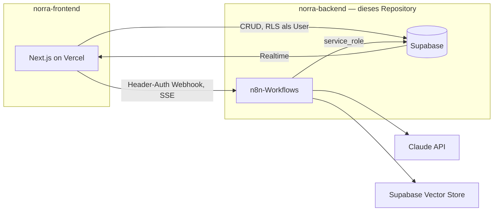

# Norra – Backend

Das Gehirn und die Daten der Norra-Plattform: das Supabase-Schema samt
Mandantentrennung, die n8n-Workflows, in denen die eigentliche Agentenlogik
liegt, und die Skripte, die beides mit Git synchron halten.

> **Die Oberfläche liegt woanders.** Die Next.js-App (Konsole, Web-Widget,
> Telefon-Webhooks) hat ein eigenes Repository: `norra-frontend`. Beide
> zusammen ergeben die Plattform; dieses hier läuft und wird getestet auch
> ohne das andere.

## Leitprinzip

Alles, was Logik enthält, lebt entweder als Code in Git oder als Workflow-JSON
in Git. Es gibt keinen Zustand, der nur durch Klicken in einer UI entstanden ist.

## Architektur



**n8n ist die Intelligenz.** Zentraler Workflow `agent-turn`: Webhook
(`responseMode: streaming`, Header-Auth) → AI Agent Node (Streaming) →
Supabase Vector Store als Retrieval-Tool → Custom Tools und Sub-Agenten via
Execute-Workflow-Node.

**Supabase ist die einzige Integrationsfläche.** n8n schreibt Ergebnisse per
Supabase-Node zurück; Realtime pusht sie an Chat-UI und Handoff-Dashboard.
Next.js und n8n sprechen nie direkt miteinander außer über die Webhooks.

**Next.js ist dünn** — Auth, UI und Proxy-Routen, keine Claude-Integration und
keine Vektor-Suche. Deshalb ist die Trennlinie zwischen den beiden Repositories
genau hier: was ein Modell entscheidet oder eine Policy erzwingt, liegt hier.

## Ordnerstruktur

| Pfad | Inhalt |
|---|---|
| `supabase/migrations/` | SQL-Migrationen, per GitHub Action ausgerollt |
| `supabase/tests/` | Ausführbare Mandanten- und Governance-Garantien |
| `n8n-workflows/` | Exportierte Workflow-JSONs, abgelegt nach Trigger: `webhooks/`, `sub-workflows/` |
| `scripts/` | Sync- und Prüfskripte |
| `docs/` | Architektur- und Betriebsnotizen |

## Namenskonventionen

- **Datenbank:** `snake_case`, Tabellen im Plural, Enums als Postgres-Typen im
  Singular (`user_role`, `conversation_status`). Jede fachliche Tabelle trägt
  `organization_id` — auch wo es redundant wirkt.
- **Migrationen:** `<utc-timestamp>_<beschreibung>.sql`, aufsteigend, niemals
  rückwirkend editieren. Eine Migration = eine logische Einheit.
- **n8n-Workflows:** Dateiname = `<slug>.json`, Slug = Workflow-Name in
  kebab-case (`agent-turn.json`).

## Multi-Tenant-Regeln

Diese vier Regeln sind nicht verhandelbar:

1. **Jede fachliche Tabelle hat `organization_id`** mit
   `references organizations(id) on delete cascade`. Denormalisiert statt
   Join — RLS ohne Subquery ist schneller und schwerer falsch zu schreiben.
2. **RLS ist auf jeder Tabelle aktiv.** Policies vergleichen gegen
   `private.current_org_id()`, eine `security definer`-Funktion mit gepinntem
   `search_path`, die `public.users` für `auth.uid()` liest. `security definer`
   umgeht RLS und vermeidet damit die Endlosrekursion in der Policy auf `users`.
3. **n8n verbindet sich mit `service_role` und umgeht RLS damit vollständig.**
   Im n8n-Pfad ist RLS *keine* Verteidigungslinie. Mandantentrennung dort hängt
   allein daran, dass `public.match_kb_chunks` die `organization_id`
   serverseitig erzwingt und ohne sie hart fehlschlägt. Jede neue RPC, die n8n
   aufruft, muss dieselbe Erzwingung mitbringen.
4. **Ein User gehört zu genau einer Organisation** (`users.organization_id`).
   Multi-Org wäre später eine `organization_members`-Tabelle; bis dahin gilt
   die Spalte.

## Rollen

`user_role` = `admin` | `agent` | `customer`.

- `admin` — verwaltet Agenten, Wissensbasis und Mitglieder der eigenen Org.
- `agent` — menschlicher Support-Mitarbeiter, übernimmt Konversationen.
- `customer` — **reserviert** für ein späteres authentifiziertes Kundenportal.
  Endkunden im Chat-Widget sind heute *keine* Supabase-Auth-User; der
  Widget-Pfad läuft über den Next.js-Proxy mit signiertem Conversation-Token.

## Environment

Dieses Repository selbst braucht keine `.env` — die Skripte lesen ihre Werte
aus der Umgebung, CI aus den GitHub-Secrets weiter unten.

```bash
export N8N_BASE_URL=https://n8n-fdhh.srv1817599.hstgr.cloud
export N8N_API_KEY=...      # n8n: Settings -> API
```

Die Variablen der App (`SUPABASE_SERVICE_ROLE_KEY`, `N8N_WEBHOOK_SECRET`, …)
stehen in `norra-frontend`. Ein Wert, den beide Seiten kennen müssen, ist
`N8N_WEBHOOK_SECRET`: derselbe String in Vercel *und* in der
n8n-Credential `httpHeaderAuth` mit dem Header-Namen `x-norra-secret`.

## n8n-Instanz

Hostinger VPS, self-hosted Community Edition: `https://n8n-fdhh.srv1817599.hstgr.cloud`

| Workflow | Datei | ID | Webhook-Pfad | Zweck |
|---|---|---|---|---|
| Agent Turn | `webhooks/agent-turn.json` | `yTH3YQeR5qdNVxSI` | `POST /webhook/norra/agent-turn` | Zentraler Turn: Config laden, RAG, Streaming |
| Voice Turn | `webhooks/voice-turn.json` | `wc4s77ROyul5LR5X` | `POST /webhook/norra/voice-turn` | Ein gesprochener Turn, ohne Streaming |
| KB Ingest | `webhooks/kb-ingest.json` | `Q3XhlP6eet9eqnm0` | `POST /webhook/norra/kb-ingest` | Dokument chunken, einbetten, speichern |
| Tool: lookup_record | `sub-workflows/lookup-record.json` | `KHHKDV5CoyiDxuCO` | Sub-Workflow | Datensatz beim Kunden nachschlagen, read-only |
| Tool: escalate_to_human | `sub-workflows/escalate-to-human.json` | `pw6OzhBSG2oxagNt` | Sub-Workflow | Ticket anlegen, Konversation eskalieren |
| Tool: request_action | `sub-workflows/request-action.json` | `LwyJZr8WFsjd0L9v` | Sub-Workflow | Folgenreiche Aktion zur **Freigabe** einreichen |
| Notify Escalation | `sub-workflows/notify-escalation.json` | `zU1x0scrqFmPClmg` | Sub-Workflow | E-Mail an das Support-Team |
| Tool: identify_caller | `sub-workflows/identify-caller.json` | — | Sub-Workflow | Anrufer an seiner Nummer erkennen (nur Telefon) |
| Tool: send_sms | `sub-workflows/send-sms.json` | — | Sub-Workflow | SMS an den Anrufer (nur Telefon) |
| Tool: schedule_callback | `sub-workflows/schedule-callback.json` | — | Sub-Workflow | Rückruf notieren (nur Telefon) |
| Tool: transfer_to_department | `sub-workflows/transfer-to-department.json` | — | Sub-Workflow | An eine Fachabteilung durchstellen (nur Telefon) |

Die vier ohne ID sind neu und noch nicht auf der Instanz. Wie sie dorthin
kommen, steht in `n8n-workflows/README.md`.

### Der Mandantenfilter ist Pflicht, nicht Stil

n8n verbindet sich mit `service_role`, und die Rolle ist `BYPASSRLS`. Row Level
Security schützt den Weg über Next.js und sonst nichts. Ob Mandant A die Daten
von B erreicht, entscheidet hier ein `organization_id`-Filter, den ein Mensch in
einen Node getippt hat — und ein vergessener ist ein Datenleck, das kein
Datenbanktest je bemerkt, weil aus Sicht von Postgres nichts falsch ist.

`check-wiring.mjs` prüft das deshalb mechanisch: jede Supabase-Operation auf
einer Tabelle mit `organization_id` muss sie filtern (Lesen, Ändern, Löschen)
oder schreiben (Anlegen). Eine Tabelle ohne diese Spalte ist ausgenommen — sie
kann nicht zwischen Mandanten lecken. `organizations` ist der einzige Sonderfall,
und aus echtem Grund: dort **ist** `id` der Mandant.

### Was der Agent nie bestimmt

Am Telefon gibt es keine Sitzung, keinen Login, keine Seite zum Nachschlagen.
Der Agent bekommt dort mehr Macht als im Chat — und genau deshalb gilt für alle
vier Telefon-Tools dieselbe Regel:

> **Das Modell bestimmt die Worte, nie das Ziel.**

Konkret heißt das:

| Tool | Was das Modell liefert | Woher das Ziel kommt |
|---|---|---|
| `identify_caller` | nichts | `calls.from_e164` — es kann nur nach dem Anrufer in der Leitung fragen, nicht nach beliebigen Kontakten |
| `send_sms` | den Text | `calls.from_e164` als Empfänger, `calls.to_e164` als Absender |
| `schedule_callback` | Grund und Zeitwunsch | `calls.from_e164` als Rückrufnummer |
| `transfer_to_department` | einen Abteilungs**namen** | `phone_departments.e164`, nachgeschlagen in `/api/voice/turn` |

Bei der Weiterleitung ist das nicht Vorsicht, sondern notwendig: läge die Nummer
irgendwo im Kontext des Modells, könnte ein präparierter Text im
Wissensdokument oder im gesprochenen Satz des Anrufers sie ersetzen — und der
Anruf ginge auf Rechnung des Kunden zu einem Fremden. Es gibt deshalb keinen
Pfad, auf dem eine Rufnummer aus dem Modell in ein `<Dial>` gelangt. Der
Sub-Workflow gibt einen Namen zurück, die Route schlägt ihn nach, und ein Name
ohne Zeile in der Tabelle führt zu keiner Verbindung.

Die Szenarien `Eine erfundene Nummer wird niemals gewählt` und `Eine pausierte
Abteilung nimmt keine Anrufe` in `tests/voice/scenarios.mjs` halten das fest.

### Ordnung auf der Instanz

Die Instanz hostet auch fremde Workflows. Die von Norra tragen deshalb Tags:

| Tag | Workflows |
|---|---|
| `norra` | alle sieben |
| `norra:core` | `agent-turn`, `voice-turn`, `kb-ingest` |
| `norra:tool` | `lookup_record`, `escalate_to_human`, `request_action` |
| `norra:notify` | `notify-escalation` |

Der Export filtert weiterhin über den Namenspräfix `Norra – `, nicht über Tags —
ein vergessener Tag würde einen Workflow sonst still aus dem Backup fallen lassen.

### Verdrahtung prüfen

```bash
node scripts/check-wiring.mjs
```

Prüft, was still auseinanderläuft und erst beim Kunden auffällt: ein
umbenannter Webhook-Pfad, ein Payload-Feld, das der Workflow nicht mehr liest,
eine Spalte, in die ein Workflow schreibt, die es nicht mehr gibt — und
umgekehrt eine Spalte, die **niemand schreibt**.

Die letzte ist die unangenehmste, weil sie nicht scheitert: eine Spalte ohne
Schreiber antwortet dauerhaft mit ihrem Default, und der Screen daneben zeigt
die Null als wäre sie gemessen. Genau so stand `agent_test_runs.tools_used`
bei jedem Lauf leer, während die Seite ihn brav gerendert hat. Ein Default
zählt dabei nur dann als Schreiber, wenn er einen Wert *erzeugt* (`now()`,
`gen_random_uuid()`, ein Ausdruck); `default '{}'` ist ein Platzhalter, den
jemand verlassen soll.

Spalten, die bewusst noch keinen Schreiber haben, stehen in `RESERVED` im
Skript, jede mit ihrem Grund. Die Liste soll kurz bleiben und schrumpfen —
ein Eintrag dort ist eine Entscheidung, kein Weg am Check vorbei. Wird eine
reservierte Spalte später doch geschrieben, sagt der Check das und verlangt,
den Eintrag zu entfernen: ein veralteter Vermerk ist der Weg, auf dem der
nächste echte Fund durchgewunken wird.

Seit den Telefon-Tools prüft es zusätzlich, dass **jedes Tool auf einen
Sub-Workflow zeigt, den dieses Repository kennt**. Ein `toolWorkflow`-Node
nennt sein Ziel im Feld `cachedResultName`; benennt jemand den Sub-Workflow um
oder vertippt sich, bekommt der Agent ein Tool, das beim ersten Gebrauch
scheitert — und zwar während ein Kunde am Telefon ist. Der Deploy-Job löst diese
Namen zu Instanz-IDs auf, dieser Check fängt denselben Fehler schon im Pull
Request.

Die App-seitige Hälfte braucht den Frontend-Checkout. Liegen beide Repos
nebeneinander — als `norra-frontend` oder als `frontend` — findet das Skript
ihn von selbst; sonst:

```bash
NORRA_APP_DIR=/pfad/zur/app node scripts/check-wiring.mjs
```

Ohne ihn läuft die Schema-gegen-Workflow-Hälfte trotzdem und meldet
ausdrücklich, dass der Rest übersprungen wurde. Das ist die Hälfte, die dieses
Repository allein kaputtmachen kann; die andere läuft in der CI von
`norra-frontend`, wo eine Route sich überhaupt erst ändert.

### Wer füllt die Auswertung

`topic`, `knowledge_gap` und `title` schreibt ein Klassifikations-Schritt am Ende
von `agent-turn`, nach der gestreamten Antwort — er kostet den Kunden also keine
Wartezeit. Ohne ihn bleiben Topic Explorer und Gap Detection dauerhaft leer.
`csat` kommt aus `/api/feedback`, das die Bewertungsleiste im Web-Widget nach
der ersten Antwort einblendet — einmalig pro Konversation, weggeklickt oder
beantwortet bleibt sie verschwunden. Die Route läuft über den Service-Role-Key
und authentifiziert wie jede andere Widget-Route über das signierte Token aus
`lib/widget/token.ts`, nicht über Konversations- und Organisations-ID im
Body: der Kanal *Web* ist der einzige, an dem eine Bewertung überhaupt anfällt,
also nutzt die Route dieselbe Vertrauensgrenze, die für diesen Kanal ohnehin
schon gilt, statt eine eigene zu erfinden.

Der Klassifikator nutzt `claude-opus-5` mit `temperature: 0`. Ein günstigeres
Modell wäre hier der naheliegende Kostenhebel — das ist eine bewusste
Entscheidung, keine Vorgabe.

### Freigaben statt Ausführung

`request_action` legt zusätzlich zum Ticket eine Zeile in `approvals` an. Das ist
die eigentliche Sperre: ein Ticket ist eine Notiz, die jemand übersehen kann,
eine Freigabe bleibt offen, bis ein Admin im Governance-Screen entscheidet. Ein
Check-Constraint verweigert jede Entscheidung ohne Entscheider.

Jedes weitere Tool mit realer Konsequenz gehört denselben Weg: Zeile in
`approvals`, Rückgabewert sagt dem Agenten ausdrücklich, dass nichts ausgeführt
wurde.

Alle sieben Workflows sind **angelegt, aber nicht aktiviert**. Vor der
Aktivierung fehlen zwei Credentials, die es auf der Instanz noch nicht gibt:

| Credential | Typ | Gebraucht von |
|---|---|---|
| Anthropic | `anthropicApi` | Claude Model in `agent-turn` und `voice-turn` |
| Norra Webhook Secret | `httpHeaderAuth` | alle drei Webhook-Nodes |

Die Header-Auth-Credential muss Header-Name `x-norra-secret` und als Wert
denselben String tragen wie `N8N_WEBHOOK_SECRET` in Vercel — sonst weist der
Webhook den Proxy ab. Supabase- und OpenAI-Credentials hat n8n beim Anlegen
automatisch zugeordnet.

### Tool-Regeln

Zwei Regeln, die für jedes neue Tool gelten:

1. **Der Mandant ist nie ein Modellfeld.** `organization_id` und
   `conversation_id` werden in den Tool-Nodes fest aus `Normalize Request`
   verdrahtet, nicht über die vom Modell befüllten Felder. Ein Modell, das den
   Mandanten wählen darf, ist ein Modell, das ihn verwechseln kann.
2. **`Return To Agent` steht zuletzt.** Ein Sub-Workflow gibt die Ausgabe seines
   letzten Nodes an den Aufrufer zurück. Steht das Logging hinten, bekommt der
   Agent Protokolldaten statt einer Antwort.

### Eskalations-Benachrichtigung

`escalate_to_human` ruft nach dem Ticket `notify-escalation` auf. Der Empfänger
steht in der Spalte `organizations.escalation_email` — pro Organisation im
Screen *Einstellungen* konfigurierbar, ohne den Workflow anzufassen. Ist keine
Adresse hinterlegt, endet der Lauf sauber über `Return Skipped`.

Der Aufruf trägt `onError: continueRegularOutput`: eine fehlgeschlagene Mail
darf die Eskalation nicht scheitern lassen. Das Ticket ist der Vorgang, die Mail
nur der Hinweis darauf.

### Warum `request_action` nichts ausführt

Das Tool nimmt jede folgenreiche Aktion entgegen — Erstattung, Stornierung,
Datenänderung — und führt keine davon aus: es legt ein Ticket mit hoher
Priorität plus eine Zeile in `approvals` an, und sein Rückgabewert sagt dem
Agenten ausdrücklich, dass nichts ausgeführt wurde. Grund: ein Sprachmodell, das
eine Vorgangsnummer oder einen Betrag halluziniert, würde sonst realen Schaden
anrichten, der nicht zurückzuholen ist.

Wenn eine Aktion später autonom laufen soll, gehört sie als eigener Zweig hinter
die Freigabe — mit Obergrenze, Whitelist und Idempotenzschlüssel gegen
Doppelausführung, nicht als weiteres Modellfeld.

### Tool-Endpunkte gehören dem Kunden

`lookup_record` ruft keinen fest verdrahteten Dienst auf. Die URL steht pro
Agent in `agents.tools` als `[{"slug": "lookup_record", "enabled": true,
"config": {"url": "https://..."}}]` und wird im Agenten-Editor gepflegt; der
Workflow liest sie zur Laufzeit aus `Load Agent Config`. Die Authentifizierung
läuft über die n8n-Credential `httpHeaderAuth` — der Endpunkt selbst steht
damit in der Datenbank, das Geheimnis nicht. Das Formular verlangt `https://`,
weil der Aufruf Kundenkennungen trägt.

### Warum die History aus dem Proxy kommt

Der Proxy liest die letzten 20 Nachrichten aus `messages` und schickt sie im
Request-Body mit, statt dass n8n sie selbst abfragt. Grund: bei der ersten
Nachricht einer Konversation liefert die Abfrage null Zeilen, und n8n
überspringt Nodes ohne Input-Items — die Kette wäre gestorben, bevor der Agent
je gelaufen wäre. Nebeneffekt: `messages` bleibt einzige Quelle der Wahrheit,
es gibt keine zweite History-Tabelle (deshalb auch kein Postgres-Chat-Memory).

## GitHub ↔ n8n Synchronisation

n8n's native Git-Environments sind Enterprise-only und auf der Community-Instanz
nicht verfügbar. Dieselbe Wirkung erreicht `scripts/n8n-sync.mjs` über die
öffentliche REST-API:

| Action | Auslöser | Was passiert |
|---|---|---|
| `n8n-backup.yml` | täglich 03:17 UTC, manuell | zieht die Workflows, committet Drift auf `master` |
| `n8n-deploy.yml` | Push auf `main` unter `n8n-workflows/**` | spielt die Dateien per `PUT` zurück |

```bash
export N8N_BASE_URL=https://n8n-fdhh.srv1817599.hstgr.cloud
export N8N_API_KEY=...                       # n8n: Settings -> API
node scripts/n8n-sync.mjs export --dry-run   # was würde sich in git ändern
node scripts/n8n-sync.mjs deploy --dry-run   # was würde auf die Instanz gehen
```

Drei Eigenschaften, auf die man sich verlassen kann:

1. **Export fasst nur `Norra – …` an.** Auf der Instanz liegen fremde Workflows
   (Sales-Team, Jarvis-Template, …). Der Namenspräfix-Filter ist die Grenze;
   ohne ihn würde ein Backup sie ins Repo ziehen.
2. **Deploy löscht nichts und legt nur auf Ansage an.** Geschrieben wird
   ausschließlich auf IDs, die eine Repo-Datei in ihrem `norra`-Block
   beansprucht. Alle IDs werden vorab aufgelöst — schlägt eine fehl, wird **gar
   nichts** geschrieben, statt einen halb deployten Stand zu hinterlassen. Neue
   Workflows entstehen nur mit `--create-missing` (siehe unten).
3. **Credentials überleben einen Deploy.** Die Repo-Dateien enthalten keine
   Credential-Verweise. Deploy übernimmt sie deshalb pro Node aus der laufenden
   Fassung — sonst würde jeder Deploy die Verknüpfungen abreißen.

### Einen neuen Workflow das erste Mal auf die Instanz bringen

Ein neuer Workflow ist ein Henne-Ei-Problem: die Datei kann keine Instanz-ID
tragen, bevor die Instanz sie hat, und die Instanz hat sie nicht, bevor jemand
die Datei hochlädt. Bisher wurde diese Lücke von Hand im n8n-Editor geschlossen
— genau der Schritt, der in Git keine Spur hinterlässt.

```bash
node scripts/n8n-sync.mjs deploy --create-missing --dry-run   # erst ansehen
node scripts/n8n-sync.mjs deploy --create-missing             # dann anlegen
```

Zwei Dinge machen das ungefährlich:

- **Gleichnamiges wird adoptiert, nicht verdoppelt.** Liegt auf der Instanz
  schon ein Workflow desselben Namens, übernimmt die Datei dessen ID, statt
  eine zweite Kopie anzulegen. Zwei Workflows unter einem Namen wären der
  schlimmere Fehler: die Tool-Nodes griffen sich, was das Listing zuerst
  liefert. Nebeneffekt: ein zweiter Lauf ist folgenlos.
- **Die ID wird in die Repo-Datei zurückgeschrieben** — als einzige geänderte
  Zeile. Erst damit gilt sie; ohne den Rückschreib-Schritt legte der nächste
  Lauf denselben Workflow noch einmal an. **Diese Änderung gehört committet.**

Deshalb läuft `--create-missing` bewusst *nicht* in der CI: dort ginge der
Rückschreib-Schritt mit dem Runner verloren.

### Was zwischen Repo und erstem echten Anruf steht

Drei Dinge an Norra entstehen nicht durch Code, sondern durch Klicks in n8n:
eine Credential wird angelegt, an einen Node gehängt, ein Workflow wird
aktiviert. Genau die kann dieses Repository nicht garantieren — und genau die
fallen erst auf, wenn ein Kunde in der Leitung ist und der Agent schweigt.

```bash
node scripts/preflight.mjs      # nur lesend; Exit 1, solange etwas blockiert
```

Es meldet, nach Workflow gruppiert: fehlende Workflows, inaktive Webhooks
(ein inaktiver Webhook antwortet mit 404), Nodes ohne die Credential, die ihr
Typ verlangt, offene Tool-Verweise und Abweichungen zwischen Repo und Instanz.
Welcher Node welche Credential braucht, steht als Tabelle im Skript und ist
gegen die Typdefinitionen der Nodes geprüft, nicht geraten. Ein Node-Typ, der
in keiner der beiden Listen steht, wird gemeldet — sonst wäre ein neu
hinzugefügter Node ohne Credential genau der Fall, den die Prüfung nicht sieht.

Im Deploy-Job läuft dasselbe Skript nach dem Push und schreibt seinen Bericht
in die Job-Zusammenfassung, **ohne** den Job scheitern zu lassen: was dort
fehlt, kann nur ein Mensch tun, und ein Check, der bis dahin dauerhaft rot
steht, erzieht dazu, rote Checks zu übersehen.

Volatile Felder (`updatedAt`, `versionId`, `id`, …) werden beim Export
entfernt, damit ein unveränderter Workflow keinen Diff erzeugt und ein echter
nicht darin untergeht.

**Eine Ausnahme vom Leitprinzip, bewusst:** die Workflow-`description` im
n8n-Editor. Die öffentliche API nimmt sie auf `PUT` nicht an (`400`), also
kann sie nicht zurückgespielt werden und wird deshalb auch nicht exportiert.
Die versionierte Erklärung eines Workflows sind die Sticky Notes auf dem
Canvas — die liegen als Nodes in der Repo-Datei. Die `description` ist nur
die Zeile in der Workflow-Liste; nichts Fachliches gehört dort hinein.

### Benötigte GitHub-Secrets

| Secret | Wofür |
|---|---|
| `N8N_BASE_URL` | `https://n8n-fdhh.srv1817599.hstgr.cloud` |
| `N8N_API_KEY` | n8n → Settings → API |
| `SUPABASE_ACCESS_TOKEN` | Migrationen ausrollen |
| `SUPABASE_PROJECT_ID` | Migrationen ausrollen |
| `SUPABASE_DB_PASSWORD` | Migrationen ausrollen |

## Befehle

Migrationen und Mandantentrennung gegen ein blankes Postgres prüfen — genau
das, was `db-migrate.yml` in CI tut:

```bash
cd supabase
psql -v ON_ERROR_STOP=1 -f tests/bootstrap.local.sql
for f in migrations/*.sql; do psql -v ON_ERROR_STOP=1 -q -f "$f"; done
for t in tenancy governance phone; do
  psql -v ON_ERROR_STOP=1 -f "tests/$t.test.sql"   # jeder muss "all checks passed" melden
done
```

```bash
supabase db push                             # Migrationen ausrollen (macht sonst die Action)
node scripts/check-wiring.mjs                # Verdrahtung prüfen
node scripts/preflight.mjs                   # was fehlt der Instanz noch
node scripts/n8n-sync.mjs export --dry-run   # was würde sich in git ändern
node scripts/n8n-sync.mjs deploy --dry-run   # was würde auf die Instanz gehen
node scripts/n8n-sync.mjs deploy --create-missing --dry-run  # inkl. neuer Workflows
```

Nach einer Schema-Änderung gehört der Typ in `norra-frontend` nachgezogen:

```bash
supabase gen types typescript --linked > "$NORRA_APP_DIR/src/types/database.ts"
```
