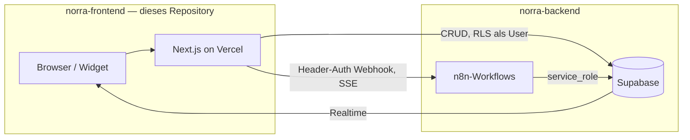
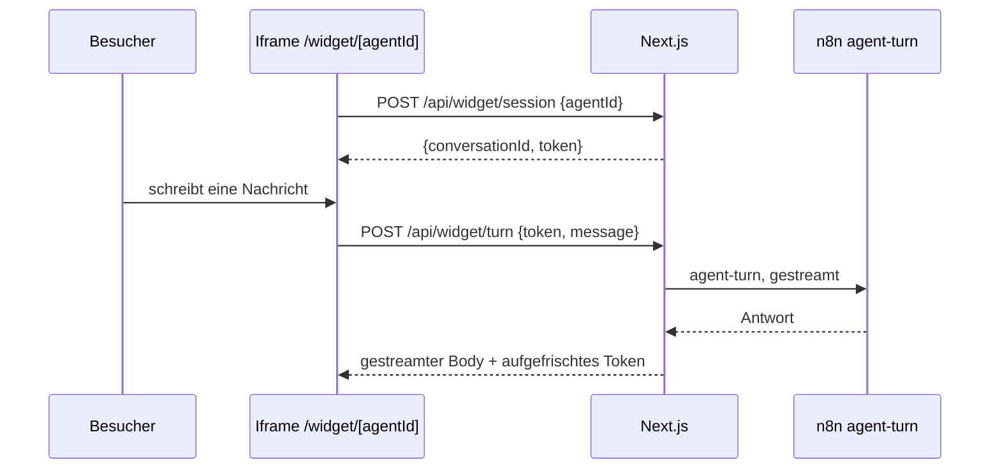
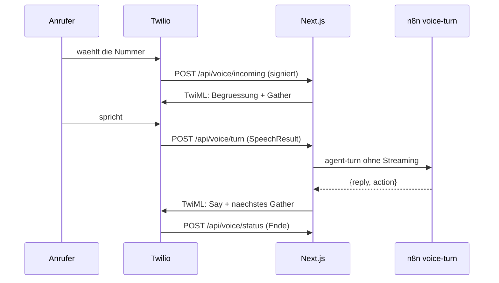

# Norra – Frontend

Die Next.js-App der Norra-Plattform: die Betreiber-Konsole, das einbettbare
Web-Widget und die dünnen API-Routen, die beides mit dem Backend verbinden.

> **Schema und Agentenlogik liegen woanders.** Supabase-Migrationen und die
> n8n-Workflows haben ein eigenes Repository: `norra-backend`. Diese App
> enthält bewusst **keine** Claude-Integration und **keine** Vektor-Suche.

## Leitprinzip

Alles, was Logik enthält, lebt entweder als Code in Git oder als Workflow-JSON
in Git. Es gibt keinen Zustand, der nur durch Klicken in einer UI entstanden ist.

## Architektur



**Next.js ist dünn.** Es macht Auth, UI/Dashboard, direkte Supabase-Reads und
Proxy-Routen, die eine Nachricht persistieren, den n8n-Webhook aufrufen und den
gestreamten Body 1:1 durchreichen. Die Intelligenz liegt in n8n, das Schema in
Supabase — beides in `norra-backend`.

Was das praktisch heißt: eine Änderung am Verhalten eines Agenten gehört fast
nie hierher. Hierher gehört, was der Betreiber *sieht* und was ein Besucher
*anfassen* kann.

## Ordnerstruktur

| Pfad | Inhalt |
|---|---|
| `src/app/(console)/` | Root-Layout der Konsole, darunter `(admin)/` (acht Screens) und `(auth)/` (Login, Registrierung) |
| `src/app/api/` | Proxy- und Webhook-Routen (Agent-Turn, Voice, Widget, Feedback) |
| `src/app/widget/` | Das öffentliche Chat-Widget mit **eigenem Root-Layout**, läuft im Iframe auf Kundenseiten |
| `src/styles/` | `base.css` (Tokens + Resets, beide Oberflächen), `console.css`, `widget.css` |
| `src/components/` | Geteilte Bausteine (Nav, Skeletons, CopyField) |
| `src/lib/` | Supabase-Clients, Env-Validierung, Voice- und Widget-Hilfen |
| `src/types/database.ts` | Handgeschriebener Spiegel des Backend-Schemas |
| `tests/voice/`, `tests/widget/`, `tests/simulate/`, `tests/console/` | End-to-End gegen die gebaute App |
| `tests/mocks/` | Geteilte Stand-ins für PostgREST, GoTrue und n8n |

### Zwei Root-Layouts, zwei Stylesheets

Konsole und Widget sind zwei getrennte Oberflächen, kein gemeinsames
Root-Layout: `(console)/layout.tsx` und `widget/layout.tsx` bringen beide ihr
eigenes `<html>`/`<body>` mit. Grund ist das Widget — es lädt im Iframe auf der
Website eines Kunden und soll weder die Admin-Shell noch deren CSS mitziehen.

```
base.css      Tokens, Element-Resets, Keyframes   -> beide
console.css   Shell, Tabellen, Charts, Skeletons  -> nur (console)
widget.css    Widget-Blasen, Compose, CSAT        -> nur widget
```

Eine Regel, die nur eine Oberfläche rendert, gehört in deren Datei — nicht in
`base.css`. Wächst etwas zum geteilten Baustein (wie der Tipp-Indikator
`.typing`), wandert es nach `base.css`.

### Tools am Telefon

Der Katalog in `src/lib/tools.ts` trägt seit den Telefon-Tools ein Feld
`channel`. Es ist keine Vorliebe, sondern eine Tatsache: die vier Tools
`identify_caller`, `send_sms`, `schedule_callback` und `transfer_to_department`
brauchen eine `call_id`, und eine Chat-Konversation hat keine. Der Agent-Editor
zeigt sie deshalb in einer eigenen Karte.

Sie sind dort **nicht deaktiviert**, wenn dem Agenten noch keine Nummer
zugewiesen ist — nur mit einem Hinweis versehen. Ein `disabled`-Feld wird vom
Browser nicht mitgeschickt und würde ein einmal gesetztes Tool beim nächsten
Speichern stillschweigend wieder entfernen.

Bei `transfer_to_department` liegt die Absicherung in `/api/voice/turn`: das
Modell liefert einen Abteilungs**namen**, die Route schlägt ihn in
`phone_departments` nach und wählt nur eine dort hinterlegte Nummer. Warum das
so und nicht anders geht, steht im Backend-`CLAUDE.md` unter „Was der Agent nie
bestimmt".

## Namenskonventionen

- **TypeScript:** `camelCase` für Variablen, `PascalCase` für Typen. Kein `any`.
  DB-Zeilen kommen aus `Database` in `src/types/database.ts`.
- **Server Actions** liegen in `actions.ts` neben der Seite, die sie benutzt.
- **`loading.tsx`** gehört zu jeder Route, die Daten lädt.

`src/types/database.ts` ist der einzige Ort, an dem dieses Repository das
Schema des anderen kennt. Nach einer Migration dort:

```bash
supabase gen types typescript --linked > src/types/database.ts
```

## Multi-Tenant-Regeln

Zwei davon betreffen diese App direkt:

1. **RLS ist die Verteidigungslinie im Next.js-Pfad.** Alles, was mit dem
   Server-Client des angemeldeten Users läuft, ist automatisch auf dessen
   Organisation beschränkt — deshalb filtert kaum eine Query hier von Hand
   nach `organization_id`.
2. **Wo kein User existiert, gilt die Signatur.** Voice-Webhooks und das
   Web-Widget laufen mit dem Service-Role-Key, der RLS vollständig umgeht. Dort
   trägt eine Signatur die Last: die Twilio-Signatur beim Telefon, das
   signierte Token beim Widget. Beide leiten den Mandanten *ab*, statt ihn aus
   dem Request zu lesen.

Die vollständigen Regeln stehen in `norra-backend/CLAUDE.md`.

## Rollen

`user_role` = `admin` | `agent` | `customer`.

- `admin` — verwaltet Agenten, Wissensbasis und Mitglieder der eigenen Org.
- `agent` — menschlicher Support-Mitarbeiter, übernimmt Konversationen.
- `customer` — **reserviert** für ein späteres authentifiziertes Kundenportal.
  Endkunden im Chat-Widget sind heute *keine* Supabase-Auth-User; der
  Widget-Pfad läuft über den Next.js-Proxy mit signiertem Conversation-Token.

## Environment

| Variable | Wo | Zweck |
|---|---|---|
| `NEXT_PUBLIC_SUPABASE_URL` | Vercel, lokal | Supabase-Projekt-URL |
| `NEXT_PUBLIC_SUPABASE_ANON_KEY` | Vercel, lokal | Client-/SSR-Key, RLS greift |
| `SUPABASE_SERVICE_ROLE_KEY` | nur Server | umgeht RLS — niemals an den Client |
| `N8N_WEBHOOK_URL` | Vercel | Basis-URL der n8n-Instanz |
| `N8N_WEBHOOK_SECRET` | Vercel + n8n | Header-Auth zwischen Proxy und Webhook |
| `TWILIO_AUTH_TOKEN` | nur Server, optional | Signaturprüfung der Telefonie-Webhooks |
| `NORRA_PUBLIC_URL` | Vercel, optional | öffentliche Basis-URL für Telefonie-Signatur und Embed-Code |

Das Web-Widget braucht keine eigene Variable — sein Signaturschlüssel leitet
sich aus `N8N_WEBHOOK_SECRET` ab (siehe *Das Web-Widget*).

Secrets stehen niemals im Repo. `.env.local` ist gitignored; `.env.example`
dokumentiert nur die Namen.

`N8N_WEBHOOK_SECRET` muss denselben String tragen wie die n8n-Credential
`httpHeaderAuth` mit dem Header-Namen `x-norra-secret` — sonst weist der
Webhook den Proxy ab.

## Wer füllt die Auswertung

`topic`, `knowledge_gap` und `title` schreibt ein Klassifikations-Schritt am Ende
von `agent-turn`, nach der gestreamten Antwort — er kostet den Kunden also keine
Wartezeit. Ohne ihn bleiben Topic Explorer und Gap Detection dauerhaft leer.
`csat` kommt aus `/api/feedback`, das die Bewertungsleiste im Web-Widget nach
der ersten Antwort einblendet — einmalig pro Konversation, weggeklickt oder
beantwortet bleibt sie verschwunden. Die Route läuft über den Service-Role-Key
und authentifiziert wie jede andere Widget-Route über das signierte Token aus
`lib/widget/token.ts`, nicht über Konversations- und Organisations-ID im
Body: der Kanal *Web* ist der einzige, an dem eine Bewertung überhaupt anfällt,
also nutzt die Route dieselbe Vertrauensgrenze, die für diesen Kanal ohnehin
schon gilt, statt eine eigene zu erfinden.

Der Klassifikator nutzt `claude-opus-5` mit `temperature: 0`. Ein günstigeres
Modell wäre hier der naheliegende Kostenhebel — das ist eine bewusste
Entscheidung, keine Vorgabe.

## Ohne Entwicklung nutzbar

Ein Agent lässt sich vollständig ohne Codezugriff aufbauen und live schalten:
eine Vorlage liefert System-Prompt und Guardrails, der Editor deckt Tools,
Kanäle und Testfälle ab, und der Kanal *Web* endet in einem Code, den man in
die eigene Website einfügt — nirgends dazwischen ist ein Deploy oder ein Ticket
nötig.

**Vorlagen** (`agents/templates.ts`) sind statische Startpunkte, keine
KI-Generierung: Next.js hat bewusst keine Claude-Integration, siehe
Architektur oben. Eine Vorlage füllt System-Prompt, verbotene Themen und
Standard-Tools vor; `[Unternehmen]` im Text ist ein Platzhalter, den der
Betreiber vor dem Livegang ersetzt — Norra kennt den Firmennamen zum
Anlagezeitpunkt nicht.

**Kanäle** (`agents.channels`) entscheiden, wo ein Agent überhaupt erreichbar
ist; die Datenbank verweigert eine leere Liste. Voice hängt zusätzlich an einer
Nummer in `phone_numbers`, Web direkt am Widget unten.

**Testfälle** (`agent_test_cases`) sind ein Formular auf der Agenten-Seite,
nicht nur ein Datenbank-Insert — das war die letzte Lücke, die für "vor dem
Start testen" einen Entwickler gebraucht hätte.

Ein Fall prüft dreierlei: was die Antwort enthalten muss, was sie nie enthalten
darf, und **welches Tool tatsächlich gelaufen ist**. Das dritte lässt sich am
Antworttext nicht feststellen — „ich habe ein Ticket angelegt" schreibt ein
Modell auch dann, wenn es `escalate_to_human` nie gerufen hat. Geprüft wird
deshalb gegen `tool_calls_log`, das die Sub-Workflows selbst schreiben.

Die Zuordnung läuft über Zeilen-IDs, nicht über Zeitstempel: alle Fälle eines
Laufs teilen sich dieselbe Wegwerf-Konversation, und `created_at` kommt aus
Postgres, während der Runner `Date.now()` kennt. Ein paar Sekunden Uhrenversatz
würden einem Fall den Tool-Aufruf eines anderen zuschreiben.

## Das Web-Widget

Der einzige Kanal, auf dem eine Organisation einen Agenten heute selbst vor
echte Kunden stellt, ohne Telefonnummer oder E-Mail-Anbindung. Der Code, den
der Kunde in seine Seite einfügt, steht direkt auf der Agenten-Seite, sobald
der Kanal *Web* aktiv ist:

```html
<script src="https://<host>/api/widget/embed" data-agent="<agent-id>" async></script>
```

Das Skript liest seinen eigenen `data-agent` und die eigene `src`-Origin aus
und hängt einen schwebenden Button plus ein Iframe auf `/widget/[agentId]` ein
— dieselbe Zeile funktioniert auf jeder Domain und jedem Deploy, ohne dass der
Betreiber eine Basis-URL eintragen muss.



Drei Entscheidungen, die nicht offensichtlich sind:

1. **Das signierte Token ist die gesamte Vertrauensgrenze**, nicht bloß eine
   Ergänzung zu ihr. Ein Website-Besucher ist kein Supabase-User; `/api/widget/*`
   liegt in `PUBLIC_PATHS` und jede Route liest `organization_id`, `agent_id`
   und `conversation_id` ausschließlich aus dem Token (`lib/widget/token.ts`),
   nie aus dem Request-Body. Ein Body-Feld mit einer fremden Organisations-ID
   wird schlicht ignoriert. Format ist HMAC-SHA256 über eine JSON-Payload, kein
   JWT — dieselbe Idee wie die Twilio-Signatur, mit demselben Beweisstandard:
   der Test versucht ein manipuliertes, ein für eine fremde Konversation
   gefälschtes und ein korrekt signiertes, aber abgelaufenes Token, und alle
   drei müssen an derselben Stelle scheitern.
2. **Es gibt kein zweites Secret.** Der Signaturschlüssel leitet sich aus
   `N8N_WEBHOOK_SECRET` ab (`hmac('sha256', 'widget:' + secret)`) statt eine
   eigene Umgebungsvariable zu verlangen, die ein Betreiber sonst separat
   rotieren müsste, ohne dass es irgendwo einen Grund dafür gäbe.
3. **Der Agent wird bei jedem Turn neu geprüft**, nicht nur beim Sessionstart.
   Schaltet ein Betreiber den Kanal *Web* mitten in einem Gespräch ab, bricht
   der nächste Turn sauber mit 404 ab, statt mit der alten Freigabe
   weiterzulaufen.

`/api/feedback` (CSAT) authentifiziert nach demselben Muster — ein Rating ohne
gültiges Token scheitert genauso wie ein Turn ohne eines.

**Bekannte Grenze:** Vercels Functions haben kein geteiltes Gedächtnis über
Aufrufe hinweg, klassisches Rate-Limiting nach IP oder Token geht dort also
nicht ohne einen externen Store. Der Ersatz ist eine harte Obergrenze an
Nachrichten pro Konversation (`MAX_MESSAGES_PER_CONVERSATION` in
`/api/widget/turn`), durchgesetzt gegen die einzige Größe, die tatsächlich
dauerhaft ist: die Zeilenzahl in `messages`. Schutz gegen einen verteilten
Angriff ist bewusst nicht Teil dieser Route — das ist die Ebene eines WAF oder
Cloudflare vor der Domain, nicht der Anwendung.

## Der Telefon-Assistent

Ein Anruf ist eine Konversation mit `channel = 'voice'`. Was ein Anruf mehr hat
als ein Chat — eine Nummer, eine Dauer, ein Ergebnis — steht in `calls`; die
Konfiguration der Leitung in `phone_numbers`.



**Einrichtung ist ein Formular, kein Ticket.** Der Kunde trägt beim Anbieter
zwei URLs ein — `/api/voice/incoming` und `/api/voice/status` — und weist im
Screen *Telefon* einen Agenten zu. Alles Weitere (Begrüßung, Stimme,
Öffnungszeiten, Weiterleitung, Zeitlimit) ist eine Zeile in `phone_numbers`.
Der Screen zeigt die fertigen URLs zum Kopieren; sie zu beschreiben statt sie
auszufüllen ist der Unterschied zwischen fünf Minuten und einem Support-Ticket.

Vier Entscheidungen, die nicht offensichtlich sind:

1. **Die gewählte Nummer *ist* der Mandant.** Ein eingehender Anruf trägt keine
   Organisations-ID, nur `To`. Deshalb ist der Index auf `phone_numbers.e164`
   global eindeutig, nicht pro Organisation — zwei Mandanten mit derselben
   Nummer wären keine Unannehmlichkeit, sondern ein Datenleck.
2. **Authentifiziert wird per Signatur, nicht per Session.** Ein Anrufer ist
   kein Supabase-User und ein Telefonanbieter schickt kein Cookie. Die Routen
   liegen deshalb in `PUBLIC_PATHS` der Middleware und prüfen stattdessen die
   Twilio-Signatur über die vollständige URL — weshalb `NORRA_PUBLIC_URL`
   Konfiguration ist und nicht aus `X-Forwarded-Host` erraten wird.
3. **`voice-turn` streamt nicht.** Im Chat wird jedes Token sofort sichtbar; am
   Telefon hört der Anrufer erst etwas, wenn ein Satz fertig ist. Dafür zählt
   die Gesamtdauer hart: der Anbieter bricht den Webhook nach wenigen Sekunden
   ab. Norra bricht bei 12 Sekunden selbst ab und leitet weiter, statt die
   Leitung verstummen zu lassen.
4. **`action` kommt aus der Datenbank, nicht aus dem Antworttext.** Ob
   weitergeleitet wird, entscheidet der Status der Konversation, den
   `escalate_to_human` setzt. Die Antwort nach „ich verbinde Sie" zu
   durchsuchen wäre raten — das Modell kann das sagen, ohne das Tool zu rufen.

Die bekannte Grenze: dieser Aufbau nutzt Sprache-zu-Text des Anbieters und
antwortet satzweise. Das ist spürbar langsamer als eine Media-Stream-Pipeline
mit Echtzeit-Transkription. Dafür braucht es keine zusätzliche Infrastruktur
und keine offene WebSocket-Verbindung — die Abwägung ist bewusst und der
richtige Ort für eine spätere Änderung ist `voice-turn`, nicht die App.

## Einstellungen

Die Regel, nach der entschieden wird, wo eine Einstellung lebt:

> Alles, was ein Workflow oder eine Policy liest, bekommt eine echte Spalte mit
> einem echten Constraint. `organizations.settings` (jsonb) trägt nur
> Darstellungsvorlieben.

Deshalb ist `escalation_email` aus dem jsonb-Blob in eine Spalte gewandert: ein
Blob nimmt `escalaton_email` widerspruchslos an, und die Mail hört still auf zu
kommen. Ebenso `timezone`, `locale` und `retention_days`.

Secrets stehen nie in der Datenbank. Der Screen *Einstellungen* zeigt zu jeder
Integration nur, **ob** sie konfiguriert ist — nie den Wert, auch nicht
maskiert: eine maskierte Zeichenkette verrät immer noch ihre Länge, und die
Seite sieht jedes Mitglied.

## Ladezustände und Bewegung

Jede Route hat eine `loading.tsx`, gebaut aus `src/components/skeleton.tsx`.
Die Platzhalter kopieren das echte Layout — gleiche Paddings, gleiche
Card-Rahmen, gleiche Spaltenzahl. Ein Skeleton mit anderer Form als das
Ergebnis erzeugt beim Eintreffen der Daten einen sichtbaren Sprung.

Der Verlaufsgraph in Analytics ist reines SVG, keine Chart-Bibliothek: eine
Polyline über eine feste `viewBox`, die sich per `stroke-dasharray` selbst
zeichnet.

`prefers-reduced-motion: reduce` entfernt **alle** Animationen, statt sie zu
verkürzen — ein Shimmer mit 0.01s flackert weiterhin. Wer dort eine Animation
ergänzt, prüft eine Sache: hängt die Sichtbarkeit an einer echten Eigenschaft,
die die Animation verändert (`stroke-dashoffset`, `opacity: 0` im
Ausgangszustand), muss sie im Reduced-Motion-Block zurückgesetzt werden. Sonst
sieht diese Nutzergruppe das Element nie.

## Befehle

```bash
npm install        # eigenes Lockfile, nicht Teil eines Workspace
npm run dev        # Dev-Server
npm run typecheck  # tsc --noEmit, muss vor jedem Commit grün sein
npm run lint
npm run build
```

Die vier End-to-End-Suiten bauen die App selbst und fahren sie gegen
In-Memory-Stand-ins hoch:

```bash
node tests/voice/run.mjs      # 16 Szenarien vom eingehenden Anruf bis zum Status-Callback
node tests/widget/run.mjs     # 13 Szenarien von der Session bis zur Bewertung
node tests/simulate/run.mjs   # 12 Szenarien der Testfall-Simulation, als angemeldeter Admin
node tests/console/run.mjs    # 17 Szenarien der Konsolen-Routen (Agent-Turn, Wissens-Ingest)
```

**Was diese Suiten nicht beweisen können: Mandantentrennung.** Der Mock hat
kein RLS, also wäre „eine fremde Konversations-ID ergibt 404" hier grün, egal
was die Route tut — die stille Fehlgrün-Sorte. Diese Garantie wird dort
geprüft, wo sie real ist: gegen ein echtes Postgres in
`norra-backend/supabase/tests/tenancy.test.sql`. Was die Suiten sehr wohl
beweisen, ist die Kehrseite davon: dass die Route ihre `organization_id` aus
der Datenbankzeile nimmt und nicht aus dem Request-Body — denn n8n läuft mit
`service_role` und umgeht RLS vollständig.

Der Build-Schritt darin ist nicht optional: `NEXT_PUBLIC_*` wird beim Bauen
eingesetzt, eine gegen die echte Supabase-URL gebaute App redet auch dann mit
ihr, wenn die Umgebungsvariable beim Start eine andere ist.

Die Verdrahtung gegen das Backend-Schema prüft ein Skript, das drüben liegt:

```bash
NORRA_APP_DIR=$PWD node ../norra-backend/scripts/check-wiring.mjs   # bzw. ../backend/…
```
