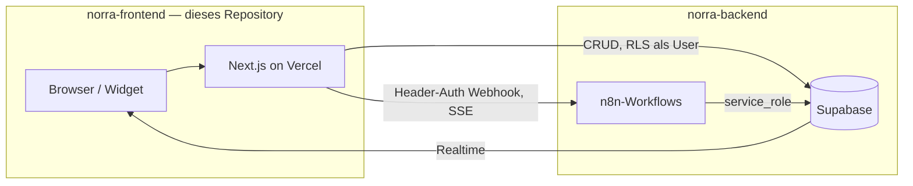
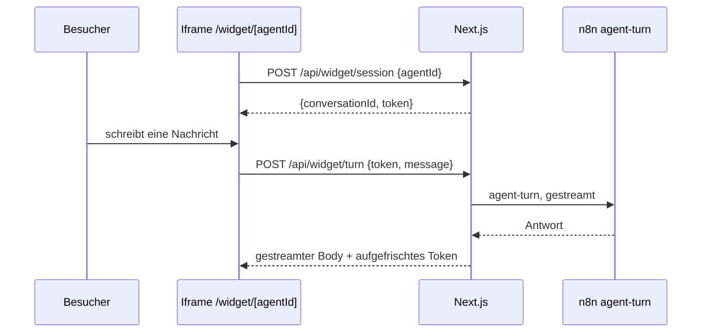
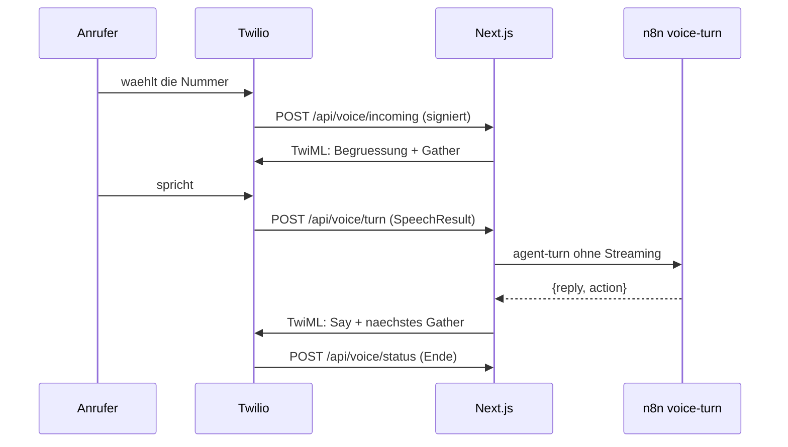

# Norra – Frontend

Die Next.js-App der Norra-Plattform: die Betreiber-Konsole, das einbettbare
Web-Widget und die dünnen API-Routen, die beides mit dem Backend verbinden.

> **Schema und Agentenlogik liegen woanders.** Supabase-Migrationen und die
> n8n-Workflows haben ein eigenes Repository: `norra-backend`. Diese App
> enthält bewusst **keine** Claude-Integration und **keine** Vektor-Suche.

## Leitprinzip

Alles, was Logik enthält, lebt entweder als Code in Git oder als Workflow-JSON
in Git. Es gibt keinen Zustand, der nur durch Klicken in einer UI entstanden ist.

## Architektur



**Next.js ist dünn.** Es macht Auth, UI/Dashboard, direkte Supabase-Reads und
Proxy-Routen, die eine Nachricht persistieren, den n8n-Webhook aufrufen und den
gestreamten Body 1:1 durchreichen. Die Intelligenz liegt in n8n, das Schema in
Supabase — beides in `norra-backend`.

Was das praktisch heißt: eine Änderung am Verhalten eines Agenten gehört fast
nie hierher. Hierher gehört, was der Betreiber *sieht* und was ein Besucher
*anfassen* kann.

## Ordnerstruktur

| Pfad | Inhalt |
|---|---|
| `src/app/(console)/` | Root-Layout der Konsole, darunter `(admin)/` (zwölf Screens) und `(auth)/` (Login, Registrierung) |
| `src/app/api/` | Proxy- und Webhook-Routen (Agent-Turn, Voice, Widget, Feedback) |
| `src/app/widget/` | Das öffentliche Chat-Widget mit **eigenem Root-Layout**, läuft im Iframe auf Kundenseiten |
| `src/styles/` | `base.css` (Tokens + Resets, beide Oberflächen), `console.css`, `widget.css` |
| `src/components/` | Geteilte Bausteine (Nav, Skeletons, CopyField) |
| `src/lib/` | Supabase-Clients, Env-Validierung, Voice- und Widget-Hilfen |
| `src/types/database.ts` | Handgeschriebener Spiegel des Backend-Schemas |
| `tests/voice/`, `tests/widget/`, `tests/simulate/`, `tests/console/` | End-to-End gegen die gebaute App |
| `tests/mocks/` | Geteilte Stand-ins für PostgREST, GoTrue und n8n |

### Zwei Root-Layouts, zwei Stylesheets

Konsole und Widget sind zwei getrennte Oberflächen, kein gemeinsames
Root-Layout: `(console)/layout.tsx` und `widget/layout.tsx` bringen beide ihr
eigenes `<html>`/`<body>` mit. Grund ist das Widget — es lädt im Iframe auf der
Website eines Kunden und soll weder die Admin-Shell noch deren CSS mitziehen.

```
base.css      Tokens, Element-Resets, Keyframes   -> beide
console.css   Shell, Tabellen, Charts, Skeletons  -> nur (console)
widget.css    Widget-Blasen, Compose, CSAT        -> nur widget
```

Eine Regel, die nur eine Oberfläche rendert, gehört in deren Datei — nicht in
`base.css`. Wächst etwas zum geteilten Baustein (wie der Tipp-Indikator
`.typing`), wandert es nach `base.css`.

### Die beiden Apple-Skills: welche gilt, welche nicht

Unter `.claude/skills/` liegen zwei installierte Design-Skills. Sie sind reine
Prosa, kein Code — und sie sind unterschiedlich viel wert.

**`apple-ui-designer`** (aus `heyman333/atelier-ui`) ist brauchbar: Prinzipien
für iOS-Oberflächen, sauber begründet. Sie ist im Widget umgesetzt.

**`apple-ui-skills`** (aus `ihlamury/design-skills`) ist es **nicht** — nicht
als Geschmacksfrage, sondern nachrechenbar. Sie verlangt selbst
*„MUST maintain text contrast ratio of at least 4.5:1"* und liefert dann eine
Palette, die auf ihrem eigenen `surface-base` (`#FFFFFF`) daran scheitert:

| Token | Farbe | Kontrast auf Weiß | |
|---|---|---|---|
| `text-primary` (Fließtext!) | `#808080` | 3.95:1 | verfehlt |
| `text-secondary` | `#6D89B5` | 3.56:1 | verfehlt |
| `text-tertiary` | `#90C5F1` | 1.84:1 | verfehlt |
| `border-default` | `#B5C7D8` | 1.73:1 | verfehlt |
| `accent` | `#155BD0` | 6.11:1 | ok |

Dazu widerspricht sie sich an mehreren Stellen: *„MUST use 4px grid"* neben
einer Skala mit 13px und 34px; *„MUST design for 1920px base viewport"* neben
der Mobile-first-Skill; `surface-raised: #0858DC` — kräftiges Blau für Karten
und Modals — ist nicht Apples Sprache. Die Tabellenspalten `Count` und
`(used 18x)` verraten, was sie ist: der maschinelle Abzug **einer** Webseite,
mit „Apple" beschriftet. Wer ihr folgt, macht Norra unzugänglicher, nicht
apple-artiger.

Sie bleibt liegen, weil sie installiert wurde. Angewendet wird sie nicht.

### Wo die brauchbare Skill gilt

`apple-ui-designer` ist Gestaltungsanweisung für **iOS-Apps**: mobile-first,
Bottom Sheets, Safe Area, gestengetrieben, „avoid dense information". Sie passt
auf genau eine der beiden Oberflächen hier.

| Oberfläche | Gilt? | Warum |
|---|---|---|
| `widget/` | **ja** | Kleine vertikale Nachrichtenliste, läuft auf dem Telefon im iframe. Genau das, wofür die Skill geschrieben ist. |
| `(console)/` | **nein** | Ein Bedienwerkzeug am Schreibtisch: Tabellen mit Konversationen, Charts, Formulare mit zwanzig Feldern. „Vermeide dichte Information" und „Bottom Sheets" würden es schlechter machen, nicht besser. |

Zwei Stellen, an denen die Skill dem bestehenden System widerspricht — dort
gewinnt das System:

- **Schrift.** Die Skill will SF Pro. Norra hat Familjen Grotesk und Instrument
  Sans, und das Widget soll aussehen wie Norra, nicht wie eine fremde App auf
  der Seite des Kunden.
- **Akzentfarbe.** Die Skill will Systemblau. Norras Waldgrün bleibt — die Skill
  selbst sagt „accent colors used sparingly", nicht „nimm unseren".

Was übrig bleibt, ist das Wertvolle daran und steht in `styles/widget.css`:

- **Rahmen weg.** Die Blasen hatten Kante *und* Fläche. Die Skill nennt genau
  das — „clear separators or spacing (not both)". Die Fläche allein trägt.
- **Berührungsflächen.** Die CSAT-Knöpfe waren 24px, unter jeder Empfehlung.
  Jetzt 34px.
- **`100dvh` statt `100vh`.** Auf dem Telefon fährt die Adressleiste ein und
  aus; `vh` rechnet mit der ausgefahrenen Höhe, und das Eingabefeld lag unter
  dem Rand.
- **`font-size: 16px` im Textfeld.** Darunter zoomt iOS beim Fokus hinein und
  kommt nicht von selbst zurück.
- **`env(safe-area-inset-*)`** an Kopf und Eingabe, `overscroll-behavior:
  contain` im Verlauf — sonst scrollt die Seite des Kunden mit.
- **Translucency** hinter `@supports`, damit ohne `backdrop-filter` der
  Vollton bleibt und der Text in jedem Fall lesbar ist.
- **`:active { scale(.92) }`** statt Hover-Effekten: auf dem Telefon gibt es
  keinen Zeiger, und der Finger verdeckt die Stelle, an der etwas passiert.

### Die zwei Grenzen am Widget

Das Widget ist die einzige Oberfläche, die Fremde erreichen — ohne Konto, ohne
Sitzung, mit einer Agent-ID, die im Einbettungs-Skript auf der Kundenseite
steht. Deshalb sind die Grenzen in `src/lib/widget/limits.ts` keine
Verteidigung in der Tiefe, sondern *die* Tiefe:

- **Zähler** in `rate_limits`, feste Fenster, atomar hochgezählt in
  `take_rate_limit`. 10 Sitzungen pro Adresse und Minute, 15 Turns pro
  Konversation und Minute, 120 pro Stunde. Adressen liegen dort nur als
  gekürzter Hash — eine IP ist personenbezogen und wird bei jedem anonymen
  Aufruf geschrieben.
- **`agents.allowed_origins`**, geprüft beim Minten der Sitzung. Leer heißt
  überall, damit Bestandsagenten nicht brechen. Eine fremde Domain bekommt
  dasselbe 404 wie ein Agent, den es nicht gibt — ein eigener Fehler würde die
  Agent-ID bestätigen.

Wenn die Datenbank nicht antwortet, wird **abgewiesen**, nicht durchgelassen.
Das ist die umgekehrte Reflexhandlung und hier richtig: ein Ausfall, der die
Grenze aussetzt, ist ein Ausfall, der dem Kunden Geld kostet.

### Tools am Telefon

Der Katalog in `src/lib/tools.ts` trägt seit den Telefon-Tools ein Feld
`channel`. Es ist keine Vorliebe, sondern eine Tatsache: die sechs Tools
`identify_caller`, `send_sms`, `schedule_callback`, `transfer_to_department`,
`take_message` und `transfer_to_person` brauchen eine `call_id`, und eine
Chat-Konversation hat keine. Der Agent-Editor zeigt sie deshalb in einer eigenen
Karte. `book_appointment` steht bewusst **nicht** darin: ein Termin lässt sich
auch im Chat vereinbaren.

Sie sind dort **nicht deaktiviert**, wenn dem Agenten noch keine Nummer
zugewiesen ist — nur mit einem Hinweis versehen. Ein `disabled`-Feld wird vom
Browser nicht mitgeschickt und würde ein einmal gesetztes Tool beim nächsten
Speichern stillschweigend wieder entfernen.

Bei `transfer_to_department` liegt die Absicherung in `/api/voice/turn`: das
Modell liefert einen Abteilungs**namen**, die Route schlägt ihn in
`phone_departments` nach und wählt nur eine dort hinterlegte Nummer. Dasselbe
gilt für `transfer_to_person` gegen `staff_members`. Warum das so und nicht
anders geht, steht im Backend-`CLAUDE.md` unter „Was der Agent nie bestimmt".

## Namenskonventionen

- **TypeScript:** `camelCase` für Variablen, `PascalCase` für Typen. Kein `any`.
  DB-Zeilen kommen aus `Database` in `src/types/database.ts`.
- **Server Actions** liegen in `actions.ts` neben der Seite, die sie benutzt.
- **`loading.tsx`** gehört zu jeder Route, die Daten lädt.

`src/types/database.ts` ist der einzige Ort, an dem dieses Repository das
Schema des anderen kennt. Nach einer Migration dort:

```bash
supabase gen types typescript --linked > src/types/database.ts
```

## Multi-Tenant-Regeln

Zwei davon betreffen diese App direkt:

1. **RLS ist die Verteidigungslinie im Next.js-Pfad.** Alles, was mit dem
   Server-Client des angemeldeten Users läuft, ist automatisch auf dessen
   Organisation beschränkt — deshalb filtert kaum eine Query hier von Hand
   nach `organization_id`.
2. **Wo kein User existiert, gilt die Signatur.** Voice-Webhooks und das
   Web-Widget laufen mit dem Service-Role-Key, der RLS vollständig umgeht. Dort
   trägt eine Signatur die Last: die Twilio-Signatur beim Telefon, das
   signierte Token beim Widget. Beide leiten den Mandanten *ab*, statt ihn aus
   dem Request zu lesen.

Die vollständigen Regeln stehen in `norra-backend/CLAUDE.md`.

## Rollen

`user_role` = `admin` | `agent` | `customer`.

- `admin` — verwaltet Agenten, Wissensbasis und Mitglieder der eigenen Org.
- `agent` — menschlicher Support-Mitarbeiter, übernimmt Konversationen.
- `customer` — **reserviert** für ein späteres authentifiziertes Kundenportal.
  Endkunden im Chat-Widget sind heute *keine* Supabase-Auth-User; der
  Widget-Pfad läuft über den Next.js-Proxy mit signiertem Conversation-Token.

## Environment

| Variable | Wo | Zweck |
|---|---|---|
| `NEXT_PUBLIC_SUPABASE_URL` | Hosting, lokal | Supabase-Projekt-URL |
| `NEXT_PUBLIC_SUPABASE_ANON_KEY` | Hosting, lokal | Client-/SSR-Key, RLS greift |
| `SUPABASE_SERVICE_ROLE_KEY` | nur Server | umgeht RLS — niemals an den Client |
| `N8N_WEBHOOK_URL` | Hosting | Basis-URL der n8n-Instanz |
| `N8N_WEBHOOK_SECRET` | Hosting + n8n | Header-Auth zwischen Proxy und Webhook |
| `TWILIO_AUTH_TOKEN` | nur Server, optional | Signaturprüfung der Telefonie-Webhooks |
| `NORRA_PUBLIC_URL` | Hosting, optional | öffentliche Basis-URL für Telefonie-Signatur und Embed-Code |
| `N8N_BASE_URL` | Hosting, optional | n8n-URL für die lesende Admin-API des Betriebs-Screens |
| `N8N_API_KEY` | nur Server, optional | n8n-API-Key, ausschließlich lesend |
| `NORRA_OPS_ORG_ID` | Hosting, optional | Organisation des Betreibers — ohne sie bleibt der Instanz-Blick zu |

### Wo die App läuft

Nichts hier ist an Vercel gebunden — kein Edge-Runtime, kein Vercel-SDK, keine
Vercel-spezifische Konfiguration. `next.config.mjs` steht auf
`output: 'standalone'`, und `norra/deploy/` enthält Compose-Datei und
Reverse-Proxy-Beispiele für den VPS, auf dem n8n schon läuft.

Eine Sache ist beim Selbsthosten anders und fällt sonst erst im Betrieb auf:
**der Proxy darf nicht puffern.** `/api/agent-turn` und `/api/widget/turn`
reichen den Body gestreamt durch; ein nginx mit `proxy_buffering on` (die
Vorgabe) sammelt ihn ein, und im Chat steht sekundenlang nichts und dann alles.

Das Web-Widget braucht keine eigene Variable — sein Signaturschlüssel leitet
sich aus `N8N_WEBHOOK_SECRET` ab (siehe *Das Web-Widget*).

Secrets stehen niemals im Repo. `.env.local` ist gitignored; `.env.example`
dokumentiert nur die Namen.

`N8N_WEBHOOK_SECRET` muss denselben String tragen wie die n8n-Credential
`httpHeaderAuth` mit dem Header-Namen `x-norra-secret` — sonst weist der
Webhook den Proxy ab.

## Wer füllt die Auswertung

`topic`, `knowledge_gap` und `title` schreibt ein Klassifikations-Schritt am Ende
von `agent-turn`, nach der gestreamten Antwort — er kostet den Kunden also keine
Wartezeit. Ohne ihn bleiben Topic Explorer und Gap Detection dauerhaft leer.
`csat` kommt aus `/api/feedback`, das die Bewertungsleiste im Web-Widget nach
der ersten Antwort einblendet — einmalig pro Konversation, weggeklickt oder
beantwortet bleibt sie verschwunden. Die Route läuft über den Service-Role-Key
und authentifiziert wie jede andere Widget-Route über das signierte Token aus
`lib/widget/token.ts`, nicht über Konversations- und Organisations-ID im
Body: der Kanal *Web* ist der einzige, an dem eine Bewertung überhaupt anfällt,
also nutzt die Route dieselbe Vertrauensgrenze, die für diesen Kanal ohnehin
schon gilt, statt eine eigene zu erfinden.

Der Klassifikator nutzt `claude-opus-5` mit `temperature: 0`. Ein günstigeres
Modell wäre hier der naheliegende Kostenhebel — das ist eine bewusste
Entscheidung, keine Vorgabe.

## Ohne Entwicklung nutzbar

Ein Agent lässt sich vollständig ohne Codezugriff aufbauen und live schalten:
eine Vorlage liefert System-Prompt und Guardrails, der Editor deckt Tools,
Kanäle und Testfälle ab, und der Kanal *Web* endet in einem Code, den man in
die eigene Website einfügt — nirgends dazwischen ist ein Deploy oder ein Ticket
nötig.

**Vorlagen** (`agents/templates.ts`) sind statische Startpunkte, keine
KI-Generierung: Next.js hat bewusst keine Claude-Integration, siehe
Architektur oben. Eine Vorlage füllt System-Prompt, verbotene Themen und
Standard-Tools vor; `[Unternehmen]` im Text ist ein Platzhalter, den der
Betreiber vor dem Livegang ersetzt — Norra kennt den Firmennamen zum
Anlagezeitpunkt nicht.

**Kanäle** (`agents.channels`) entscheiden, wo ein Agent überhaupt erreichbar
ist; die Datenbank verweigert eine leere Liste. Voice hängt zusätzlich an einer
Nummer in `phone_numbers`, Web direkt am Widget unten.

**Testfälle** (`agent_test_cases`) sind ein Formular auf der Agenten-Seite,
nicht nur ein Datenbank-Insert — das war die letzte Lücke, die für "vor dem
Start testen" einen Entwickler gebraucht hätte.

Ein Fall prüft dreierlei: was die Antwort enthalten muss, was sie nie enthalten
darf, und **welches Tool tatsächlich gelaufen ist**. Das dritte lässt sich am
Antworttext nicht feststellen — „ich habe ein Ticket angelegt" schreibt ein
Modell auch dann, wenn es `escalate_to_human` nie gerufen hat. Geprüft wird
deshalb gegen `tool_calls_log`, das die Sub-Workflows selbst schreiben.

Die Zuordnung läuft über Zeilen-IDs, nicht über Zeitstempel: alle Fälle eines
Laufs teilen sich dieselbe Wegwerf-Konversation, und `created_at` kommt aus
Postgres, während der Runner `Date.now()` kennt. Ein paar Sekunden Uhrenversatz
würden einem Fall den Tool-Aufruf eines anderen zuschreiben.

## Das Web-Widget

Der einzige Kanal, auf dem eine Organisation einen Agenten heute selbst vor
echte Kunden stellt, ohne Telefonnummer oder E-Mail-Anbindung. Der Code, den
der Kunde in seine Seite einfügt, steht direkt auf der Agenten-Seite, sobald
der Kanal *Web* aktiv ist:

```html
<script src="https://<host>/api/widget/embed" data-agent="<agent-id>" async></script>
```

Das Skript liest seinen eigenen `data-agent` und die eigene `src`-Origin aus
und hängt einen schwebenden Button plus ein Iframe auf `/widget/[agentId]` ein
— dieselbe Zeile funktioniert auf jeder Domain und jedem Deploy, ohne dass der
Betreiber eine Basis-URL eintragen muss.



Drei Entscheidungen, die nicht offensichtlich sind:

1. **Das signierte Token ist die gesamte Vertrauensgrenze**, nicht bloß eine
   Ergänzung zu ihr. Ein Website-Besucher ist kein Supabase-User; `/api/widget/*`
   liegt in `PUBLIC_PATHS` und jede Route liest `organization_id`, `agent_id`
   und `conversation_id` ausschließlich aus dem Token (`lib/widget/token.ts`),
   nie aus dem Request-Body. Ein Body-Feld mit einer fremden Organisations-ID
   wird schlicht ignoriert. Format ist HMAC-SHA256 über eine JSON-Payload, kein
   JWT — dieselbe Idee wie die Twilio-Signatur, mit demselben Beweisstandard:
   der Test versucht ein manipuliertes, ein für eine fremde Konversation
   gefälschtes und ein korrekt signiertes, aber abgelaufenes Token, und alle
   drei müssen an derselben Stelle scheitern.
2. **Es gibt kein zweites Secret.** Der Signaturschlüssel leitet sich aus
   `N8N_WEBHOOK_SECRET` ab (`hmac('sha256', 'widget:' + secret)`) statt eine
   eigene Umgebungsvariable zu verlangen, die ein Betreiber sonst separat
   rotieren müsste, ohne dass es irgendwo einen Grund dafür gäbe.
3. **Der Agent wird bei jedem Turn neu geprüft**, nicht nur beim Sessionstart.
   Schaltet ein Betreiber den Kanal *Web* mitten in einem Gespräch ab, bricht
   der nächste Turn sauber mit 404 ab, statt mit der alten Freigabe
   weiterzulaufen.

`/api/feedback` (CSAT) authentifiziert nach demselben Muster — ein Rating ohne
gültiges Token scheitert genauso wie ein Turn ohne eines.

**Bekannte Grenze:** Vercels Functions haben kein geteiltes Gedächtnis über
Aufrufe hinweg, klassisches Rate-Limiting nach IP oder Token geht dort also
nicht ohne einen externen Store. Der Ersatz ist eine harte Obergrenze an
Nachrichten pro Konversation (`MAX_MESSAGES_PER_CONVERSATION` in
`/api/widget/turn`), durchgesetzt gegen die einzige Größe, die tatsächlich
dauerhaft ist: die Zeilenzahl in `messages`. Schutz gegen einen verteilten
Angriff ist bewusst nicht Teil dieser Route — das ist die Ebene eines WAF oder
Cloudflare vor der Domain, nicht der Anwendung.

## Der Telefon-Assistent

Ein Anruf ist eine Konversation mit `channel = 'voice'`. Was ein Anruf mehr hat
als ein Chat — eine Nummer, eine Dauer, ein Ergebnis — steht in `calls`; die
Konfiguration der Leitung in `phone_numbers`.



**Einrichtung ist ein Formular, kein Ticket.** Der Kunde trägt beim Anbieter
zwei URLs ein — `/api/voice/incoming` und `/api/voice/status` — und weist im
Screen *Telefon* einen Agenten zu. Alles Weitere (Begrüßung, Stimme,
Öffnungszeiten, Weiterleitung, Zeitlimit) ist eine Zeile in `phone_numbers`.
Der Screen zeigt die fertigen URLs zum Kopieren; sie zu beschreiben statt sie
auszufüllen ist der Unterschied zwischen fünf Minuten und einem Support-Ticket.

Vier Entscheidungen, die nicht offensichtlich sind:

1. **Die gewählte Nummer *ist* der Mandant.** Ein eingehender Anruf trägt keine
   Organisations-ID, nur `To`. Deshalb ist der Index auf `phone_numbers.e164`
   global eindeutig, nicht pro Organisation — zwei Mandanten mit derselben
   Nummer wären keine Unannehmlichkeit, sondern ein Datenleck.
2. **Authentifiziert wird per Signatur, nicht per Session.** Ein Anrufer ist
   kein Supabase-User und ein Telefonanbieter schickt kein Cookie. Die Routen
   liegen deshalb in `PUBLIC_PATHS` der Middleware und prüfen stattdessen die
   Twilio-Signatur über die vollständige URL — weshalb `NORRA_PUBLIC_URL`
   Konfiguration ist und nicht aus `X-Forwarded-Host` erraten wird.
3. **`voice-turn` streamt nicht.** Im Chat wird jedes Token sofort sichtbar; am
   Telefon hört der Anrufer erst etwas, wenn ein Satz fertig ist. Dafür zählt
   die Gesamtdauer hart: der Anbieter bricht den Webhook nach wenigen Sekunden
   ab. Norra bricht bei 12 Sekunden selbst ab und leitet weiter, statt die
   Leitung verstummen zu lassen.
4. **`action` kommt aus der Datenbank, nicht aus dem Antworttext.** Ob
   weitergeleitet wird, entscheidet der Status der Konversation, den
   `escalate_to_human` setzt. Die Antwort nach „ich verbinde Sie" zu
   durchsuchen wäre raten — das Modell kann das sagen, ohne das Tool zu rufen.

Die bekannte Grenze: dieser Aufbau nutzt Sprache-zu-Text des Anbieters und
antwortet satzweise. Das ist spürbar langsamer als eine Media-Stream-Pipeline
mit Echtzeit-Transkription. Dafür braucht es keine zusätzliche Infrastruktur
und keine offene WebSocket-Verbindung — die Abwägung ist bewusst und der
richtige Ort für eine spätere Änderung ist `voice-turn`, nicht die App.

### Der Empfang

Was einen Telefonassistenten von einer Ansage unterscheidet, ist, dass er
jemanden im Haus erreicht. Der Screen *Empfang* pflegt dafür zwei Listen:
**Personen** (`staff_members`) und die **Nachrichten**, die für sie aufgenommen
wurden (`messages_for_staff`).

Drei Dinge daran sind nicht offensichtlich:

1. **Die Datenbank lässt keine unerreichbare Person zu.** Wer durchgestellt
   werden soll, braucht eine Rufnummer; wer Nachrichten bekommen soll, braucht
   Mail *oder* Nummer. Beides sind Check-Constraints, keine Formularprüfungen —
   ein Formular kann man umgehen, die Zeile nicht. Im Screen heißt das: das
   Häkchen „nimmt Anrufe an" ohne Nummer wird abgewiesen, nicht stillschweigend
   ignoriert.
2. **Durchstellen heißt Übergeben.** `transfer_to_person` schreibt einen
   Briefing-Satz nach `calls.transfer_briefing`, und `<Dial><Number url="…">`
   spielt ihn **nur der angerufenen Seite** vor, bevor die Leitungen
   zusammengeschaltet werden. Der Unterschied zwischen einem Mitarbeiter, der
   mit „Hallo?" abhebt, und einem, der weiß, wer dran ist und warum. Der Satz
   steht in der Zeile und nicht im Query-Parameter der Briefing-URL — siehe
   `/api/voice/briefing`.
3. **Mitschnitt nur mit Ansage.** `phone_numbers.recording_enabled` lässt sich
   ohne hinterlegte `recording_notice` gar nicht erst setzen; die Ansage läuft
   dann **vor** der Begrüßung, auch vor dem Anrufbeantworter. In Deutschland ist
   das Aufzeichnen des nicht öffentlich gesprochenen Worts ohne Einwilligung
   strafbar (§ 201 StGB), und eine Einwilligung setzt voraus, dass jemand
   vorher Bescheid weiß. Erzwungen wird das im Schema, nicht in der Route.

**Und wenn niemand abhebt?** Ein `<Dial>` ohne `action` ist eine Einbahnstraße:
der Anrufer hört das Freizeichen aufhören und danach nichts mehr. Genau das
unterscheidet eine Telefonanlage von einem Empfang. Deshalb trägt jedes
Durchstellen aus einem laufenden Gespräch ein `timeout` und eine Rückfall-URL
(`/api/voice/after-transfer`). Sie tut dreierlei:

1. **Nimmt die Zeile zurück.** `status: 'transferred'` wurde gesetzt, als
   niemand wissen konnte, ob jemand abhebt. Eine Zeile, die „weitergeleitet"
   behauptet, obwohl es nicht dazu kam, ist später in der Auswertung eine Lüge,
   die keiner mehr nachprüft.
2. **Sagt es dem Anrufer** und bietet an, etwas auszurichten — zurück in
   denselben Gesprächsfaden, nicht in ein neues Menü.
3. **Sagt es dem Agenten**, als Zeile in der Historie. Ohne sie führte er das
   Gespräch fort, als wäre nie durchgestellt worden, und fragte womöglich ein
   zweites Mal, ob er verbinden soll.

Die Weiterleitung *außerhalb* der Öffnungszeiten bekommt bewusst **keinen**
Rückfall: dort steht kein Agent dahinter, der eine Nachricht aufnehmen könnte.
Ihn trotzdem anzubieten hieße, etwas zu versprechen, das niemand einlöst.

### Die Sprachnachricht, die man lesen kann

`/api/voice/recording` legt das Ticket an und stößt **danach** den n8n-Workflow
`voicemail-transcribe` an. Die Reihenfolge ist die Aussage: die Nachricht muss
im Posteingang liegen, auch wenn n8n gerade steht — der Link zur Aufnahme allein
ist unbequem, aber vollständig. Die Abschrift landet später in
`calls.voicemail_transcript` und in der Beschreibung desselben Tickets.

Ohne Aufnahme-URL wird gar nicht erst angestoßen: ein Lauf, der am Ende
feststellt, dass es nichts zu holen gab, ist teurer als die Prüfung davor.

### Schließtage

`business_hours` kennt nur die Woche. Am ersten Weihnachtstag steht dort
„Donnerstag, acht bis achtzehn" und stimmt trotzdem nicht. `closure_days` steht
deshalb **über** den Öffnungszeiten: erst wird gefragt, ob heute überhaupt einer
ist, dann wie spät es ist.

Bewusst **keine mitgelieferte Feiertagsliste.** Feiertage sind pro Bundesland
verschieden, sie ändern sich, und Betriebsferien stehen in keinem Kalender. Eine
Liste, die für die Hälfte der Kunden falsch ist, ohne dass sie es merken, wäre
schlechter als ein leeres Formular. Eingetragen wird im Screen *Telefon*, einmal
im Jahr.

Zwei Feinheiten:

- **Das Datum kommt aus `Intl`, nicht aus `toISOString()`.** Letzteres rechnet in
  UTC; ein Anruf um 00:30 Berliner Zeit am 25. Dezember fiele dort auf den 24.,
  und der Schließtag griffe nicht. `localDate()` in `lib/voice/hours.ts` nutzt
  `en-CA`, das `YYYY-MM-DD` ohne Zusammenstückeln liefert.
- **Steht `after_hours` auf `agent`, antwortet er trotzdem** — er soll ja sagen
  können, wann wieder offen ist. Damit er nicht „wir haben bis achtzehn Uhr
  geöffnet" sagt, schreibt `/api/voice/incoming` eine `system`-Notiz in die
  Konversation. Nicht in den System-Prompt: der gehört dem Betreiber und wird
  nicht pro Anruf umgeschrieben.

Am Rand, aber aus demselben Geist: `gather()` nimmt **Sprache und Tastenfeld**
an, und zwar als Vorgabe — `speechOnly` muss man ausdrücklich verlangen. Wer im
Großraumbüro oder im Zug sitzt, kann oft gar nicht sprechen, und eine
Kundennummer buchstabiert am Telefon niemand gern. Die Vorgabe steht deshalb auf
der freizügigen Seite: eine vergessene Option ergibt den barrierearmen Fall,
nicht den engen. Andersherum war es schon einmal, und prompt hatte ausgerechnet
die Begrüßung kein Tastenfeld.

### Wenn der Anrufer eine andere Sprache spricht

Die Sprache hing an der Leitung und galt für den ganzen Anruf. Ein Empfang, der
nur eine Sprache kann, schickt jeden anderen weg — mit einem Satz, den dieser
Mensch nicht versteht.

`phone_languages` sagt je Leitung, welche Sprachen sie außerdem annimmt und mit
welcher Stimme. Der Wechsel läuft nach derselben Regel wie das Durchstellen:

> **Das Modell nennt einen Code, die Route schlägt ihn nach.**

Das Feld `language` in der Agent-Antwort ist eine *Bitte*, keine Anweisung. Was
nicht in `phone_languages` steht, wird nicht gesprochen — der Wert geht direkt
in ein TwiML-Attribut, und eine erfundene Zeichenkette dort ist beim Anbieter
ein Fehler, der den Anruf beendet. Eine abgelehnte Sprache beendet hier
dagegen nichts: der Satz wird gesprochen, nur in der bisherigen Sprache.

Vier Dinge, die nicht offensichtlich sind:

- **Der Wechsel greift im selben Zug.** Die Antwort auf den englischen Satz soll
  englisch klingen, nicht erst die übernächste. Deshalb steht die Auflösung vor
  dem `say(parsed.reply, …)` und `voice` ist ein `let`.
- **Zurück auf die Vorgabe ist immer erlaubt** und setzt `calls.language` auf
  `null`, nicht auf den Code der Leitung. Ändert jemand später die Sprache der
  Nummer, gilt die neue — ein eingetragener Code wäre eingefroren.
- **`language` und `voice` sind nur zusammen gesetzt**, erzwungen per
  Check-Constraint. Eine Stimme ohne Sprache wäre eine halbe Umschaltung:
  gesprochen würde anders, erkannt weiterhin wie vorher.
- **Drei Routen brauchen dieselbe Antwort** — `turn`, `briefing`,
  `after-transfer`. Sie teilen sich `voiceFor()` in `lib/voice/languages.ts`.
  Drei Kopien derselben drei Zeilen wären drei Stellen, an denen jemand eine
  vergisst; dann spräche ausgerechnet die Nachfrage nach dem gescheiterten
  Durchstellen wieder Deutsch, während der Anrufer im Freizeichen wartet.

Der Katalog in `lib/voice/languages.ts` ist eine Auswahlliste und kein
Freitextfeld — ein Tippfehler im Stimmnamen fällt nicht auf, er klingt nur. Für
die meisten Sprachen steht dort bewusst nur `alice`: Twilios Liste neuraler
Polly-Stimmen ändert sich, und ein Name, der nicht nachgeschlagen wurde, wäre
genau der Tippfehler, den das Modul verhindern soll. Wer eine neurale Stimme
will, trägt sie dort ein, nachdem er sie beim Anbieter nachgeschlagen hat.

## Betrieb

Der Screen `/betrieb` beantwortet die Frage, die sonst nur ein Terminal
beantwortet: *steht zwischen dem Repository und dem nächsten echten Anruf noch
etwas?* Er hat zwei Hälften, und sie gehören verschiedenen Leuten.

**Diese Organisation** sieht jeder Admin seines Mandanten: Leitungen mit Agent
und letztem Anruf, gescheiterte Anrufe der letzten 24 Stunden, gescheiterte
Tool-Aufrufe aus `tool_calls_log`, offene Nachbereitungen. Alles über RLS auf
die eigene Organisation beschränkt, wie jede andere Konsolen-Seite.

**Die Instanz** sieht nur der Betreiber. Die n8n-Instanz ist über alle Mandanten
hinweg dieselbe; wessen Workflows dort liegen, geht einen Kunden nichts an. Die
Grenze ist `NORRA_OPS_ORG_ID`, und sie ist **geschlossen, solange die Variable
fehlt** — ein API-Key allein reicht ausdrücklich nicht. Das Szenario *Ein fremder
Mandant sieht die Instanz nicht, auch mit gültigem Schlüssel* in
`tests/console/scenarios.mjs` setzt deshalb beides: Schlüssel vorhanden,
Organisation fremd. Ohne Schlüssel wäre „keine Instanz-Karte" kein Beweis,
sondern nur eine fehlende Zutat.

Zwei Entscheidungen dahinter:

1. **Die Sollliste steht im Frontend und wird trotzdem geprüft.** Die App läuft
   auf Vercel und hat das Backend-Repository dort nicht; sie kann die Instanz
   fragen, was da *ist*, nicht was da sein *soll*. Also schreibt
   `src/lib/ops/workflows.ts` die Workflow-Liste ab — und
   `check-wiring.mjs` vergleicht sie bei jedem Lauf mit `n8n-workflows/`, in
   beide Richtungen. Eine neue Workflow-Datei ohne Eintrag ist ein roter Lauf,
   kein Punkt, der auf dem Screen lautlos fehlt.
2. **Fehlende Credentials stehen bewusst nicht auf dem Screen.** Die Zuordnung
   „welcher Node braucht welchen Credential-Typ" hat ihre Antwort in
   `preflight.mjs`. Eine zweite Kopie hier wäre eine, die irgendwann etwas
   anderes behauptet — und die falsche von beiden wäre die, der man glaubt. Der
   Screen nennt stattdessen den Befehl.

## Einstellungen

Die Regel, nach der entschieden wird, wo eine Einstellung lebt:

> Alles, was ein Workflow oder eine Policy liest, bekommt eine echte Spalte mit
> einem echten Constraint. `organizations.settings` (jsonb) trägt nur
> Darstellungsvorlieben.

Deshalb ist `escalation_email` aus dem jsonb-Blob in eine Spalte gewandert: ein
Blob nimmt `escalaton_email` widerspruchslos an, und die Mail hört still auf zu
kommen. Ebenso `timezone`, `locale` und `retention_days`.

Secrets stehen nie in der Datenbank. Der Screen *Einstellungen* zeigt zu jeder
Integration nur, **ob** sie konfiguriert ist — nie den Wert, auch nicht
maskiert: eine maskierte Zeichenkette verrät immer noch ihre Länge, und die
Seite sieht jedes Mitglied.

## Ladezustände und Bewegung

Jede Route hat eine `loading.tsx`, gebaut aus `src/components/skeleton.tsx`.
Die Platzhalter kopieren das echte Layout — gleiche Paddings, gleiche
Card-Rahmen, gleiche Spaltenzahl. Ein Skeleton mit anderer Form als das
Ergebnis erzeugt beim Eintreffen der Daten einen sichtbaren Sprung.

Der Verlaufsgraph in Analytics ist reines SVG, keine Chart-Bibliothek: eine
Polyline über eine feste `viewBox`, die sich per `stroke-dasharray` selbst
zeichnet.

`prefers-reduced-motion: reduce` entfernt **alle** Animationen, statt sie zu
verkürzen — ein Shimmer mit 0.01s flackert weiterhin. Wer dort eine Animation
ergänzt, prüft eine Sache: hängt die Sichtbarkeit an einer echten Eigenschaft,
die die Animation verändert (`stroke-dashoffset`, `opacity: 0` im
Ausgangszustand), muss sie im Reduced-Motion-Block zurückgesetzt werden. Sonst
sieht diese Nutzergruppe das Element nie.

## Befehle

```bash
npm install        # eigenes Lockfile, nicht Teil eines Workspace
npm run dev        # Dev-Server
npm run typecheck  # tsc --noEmit, muss vor jedem Commit grün sein
npm run lint
npm run build
```

Die vier End-to-End-Suiten bauen die App selbst und fahren sie gegen
In-Memory-Stand-ins hoch:

```bash
node tests/voice/run.mjs      # 51 Szenarien vom eingehenden Anruf bis zur Nachbereitung
node tests/widget/run.mjs     # 20 Szenarien von der Session bis zur Bewertung
node tests/simulate/run.mjs   # 12 Szenarien der Testfall-Simulation, als angemeldeter Admin
node tests/console/run.mjs    # 21 Szenarien der Konsolen-Routen (Agent-Turn, Wissens-Ingest, Betrieb)
```

**Was diese Suiten nicht beweisen können: Mandantentrennung.** Der Mock hat
kein RLS, also wäre „eine fremde Konversations-ID ergibt 404" hier grün, egal
was die Route tut — die stille Fehlgrün-Sorte. Diese Garantie wird dort
geprüft, wo sie real ist: gegen ein echtes Postgres in
`norra-backend/supabase/tests/tenancy.test.sql`. Was die Suiten sehr wohl
beweisen, ist die Kehrseite davon: dass die Route ihre `organization_id` aus
der Datenbankzeile nimmt und nicht aus dem Request-Body — denn n8n läuft mit
`service_role` und umgeht RLS vollständig.

Der Build-Schritt darin ist nicht optional: `NEXT_PUBLIC_*` wird beim Bauen
eingesetzt, eine gegen die echte Supabase-URL gebaute App redet auch dann mit
ihr, wenn die Umgebungsvariable beim Start eine andere ist.

Die Verdrahtung gegen das Backend-Schema prüft ein Skript, das drüben liegt:

```bash
NORRA_APP_DIR=$PWD node ../norra-backend/scripts/check-wiring.mjs   # bzw. ../backend/…
```
